# Bank System Mod

## About
BankSystem is a Minecraft mod that brings money in to the game. Players can have a bankacount that can not only hold money but items too.
Admins can define which items can be stored in the bank in order to prevent players from using the bank as infinite storage.


<tr>
<td>
<div align="center">
    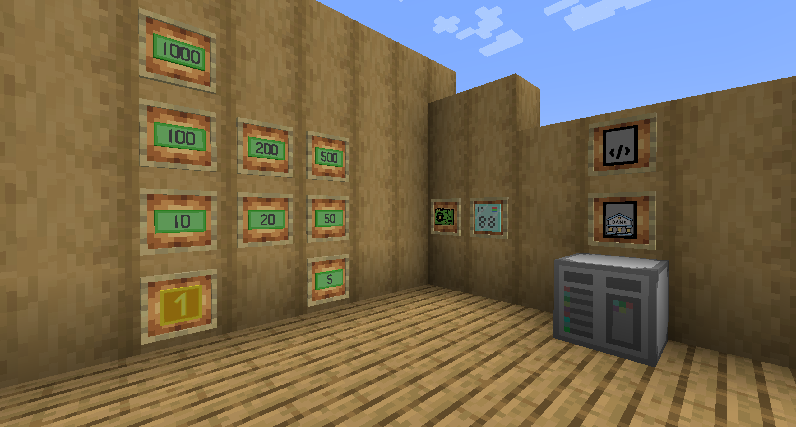 
</div>
</td>

---


## Chapters 
* [Features](#features)
* [Downloads](#downloads)
* [Blocks](#blocks)
* [Items](#items)
* [How to use](#how-to-use)
    * [For server player / single player](#for-server-player--single-player)
    * [For admins / single player](#for-admins--single-player)
* [Commands](#commands)


---
## Features
- Adds a banking system to the game for money and items.
- Adds new [blocks](#blocks) to interact with the bank account.

## Dependencies
- [Architectury](https://www.curseforge.com/minecraft/mc-mods/architectury-api)
- [Quilted Fabric API](https://www.curseforge.com/minecraft/mc-mods/qsl) (Only needed for Quilt)
- [Mod Utilities](https://www.curseforge.com/minecraft/mc-mods/modutilities) (Only needed for Quilt)
- [Fabric API](https://www.curseforge.com/minecraft/mc-mods/fabric-api) (Only needed for Fabric)

  
---
## Downloads
<!--
[CurseForge](https://www.curseforge.com/minecraft/mc-mods/stockmarket)


| Version | Download |
|---------|----------|
|1.3.0    | [](https://www.curseforge.com/minecraft/mc-mods/stockmarket/download/6002691)<br>[](https://www.curseforge.com/minecraft/mc-mods/stockmarket/download/6002684)<br>[](https://www.curseforge.com/minecraft/mc-mods/stockmarket/download/6002682)<br>[](https://www.curseforge.com/minecraft/mc-mods/stockmarket/download/6002681)<br>[](https://www.curseforge.com/minecraft/mc-mods/stockmarket/download/6002679)<br>[](https://www.curseforge.com/minecraft/mc-mods/stockmarket/download/6002676)<br>[](https://www.curseforge.com/minecraft/mc-mods/stockmarket/download/6004639)<br>[](https://www.curseforge.com/minecraft/mc-mods/stockmarket/download/6004641)<br>[](https://www.curseforge.com/minecraft/mc-mods/stockmarket/download/6004643) |

-->
[CurseForge](https://www.curseforge.com/minecraft/mc-mods/banksystem)
| Minecraft | Fabric | Forge | Quilt | Neoforge |
|-----------|--------|-------|-------|----------|
|     | [][1.3.1-fabric-1.21.1] |                                                                             |                                                                             | [][1.3.1-neoforge-1.21.1] |
|       | [][1.3.1-fabric-1.21]   |                                                                             |                                                                             | [][1.3.1-neoforge-1.21]   |
|     | [][1.3.1-fabric-1.20.6] |                                                                             |                                                                             | [][1.3.1-neoforge-1.20.6] |
|     | [][1.3.1-fabric-1.20.4] | [][1.3.1-forge-1.20.4] | [][1.3.1-quilt-1.20.4] |                                                                                |
|     | [][1.3.1-fabric-1.20.2] | [][1.3.1-forge-1.20.2] | [][1.3.1-quilt-1.20.2] |                                                                                |
|     | [][1.3.1-fabric-1.20.1] | [][1.3.1-forge-1.20.1] | [][1.3.1-quilt-1.20.1] |                                                                                |
|     | [][1.3.1-fabric-1.19.4] | [][1.3.1-forge-1.19.4] |                                                                             |                                                                                |
|     | [][1.3.1-fabric-1.19.3] | [][1.3.1-forge-1.19.3] | [][1.3.1-quilt-1.19.3] |                                                                                |
|     | [][1.3.1-fabric-1.19.2] | [][1.3.1-forge-1.19.2] | [][1.3.1-quilt-1.19.2] |                                                                                |

<!--	Links to curseforge:	-->
[1.3.1-fabric-1.19.2]:https://www.curseforge.com/minecraft/mc-mods/banksystem/download/6073135
[1.3.1-fabric-1.19.3]:https://www.curseforge.com/minecraft/mc-mods/banksystem/download/6073141
[1.3.1-fabric-1.19.4]:https://www.curseforge.com/minecraft/mc-mods/banksystem/download/6073151
[1.3.1-fabric-1.20.1]:https://www.curseforge.com/minecraft/mc-mods/banksystem/download/6070778
[1.3.1-fabric-1.20.2]:https://www.curseforge.com/minecraft/mc-mods/banksystem/download/6073156
[1.3.1-fabric-1.20.4]:https://www.curseforge.com/minecraft/mc-mods/banksystem/download/6073162
[1.3.1-fabric-1.20.6]:https://www.curseforge.com/minecraft/mc-mods/banksystem/download/6073168
[1.3.1-fabric-1.21]:https://www.curseforge.com/minecraft/mc-mods/banksystem/download/6073170
[1.3.1-fabric-1.21.1]:https://www.curseforge.com/minecraft/mc-mods/banksystem/download/6073172

[1.3.1-forge-1.19.2]:https://www.curseforge.com/minecraft/mc-mods/banksystem/download/6073139
[1.3.1-forge-1.19.3]:https://www.curseforge.com/minecraft/mc-mods/banksystem/download/6073143
[1.3.1-forge-1.19.4]:https://www.curseforge.com/minecraft/mc-mods/banksystem/download/6073152
[1.3.1-forge-1.20.1]:https://www.curseforge.com/minecraft/mc-mods/banksystem/download/6070780
[1.3.1-forge-1.20.2]:https://www.curseforge.com/minecraft/mc-mods/banksystem/download/6073158
[1.3.1-forge-1.20.4]:https://www.curseforge.com/minecraft/mc-mods/banksystem/download/6073165

[1.3.1-quilt-1.19.2]:https://www.curseforge.com/minecraft/mc-mods/banksystem/download/6073140
[1.3.1-quilt-1.19.3]:https://www.curseforge.com/minecraft/mc-mods/banksystem/download/6073150
[1.3.1-quilt-1.20.1]:https://www.curseforge.com/minecraft/mc-mods/banksystem/download/6070781
[1.3.1-quilt-1.20.2]:https://www.curseforge.com/minecraft/mc-mods/banksystem/download/6073160
[1.3.1-quilt-1.20.4]:https://www.curseforge.com/minecraft/mc-mods/banksystem/download/6073166

[1.3.1-neoforge-1.20.6]:https://www.curseforge.com/minecraft/mc-mods/banksystem/download/6073169
[1.3.1-neoforge-1.21]:https://www.curseforge.com/minecraft/mc-mods/banksystem/download/6073171
[1.3.1-neoforge-1.21.1]:https://www.curseforge.com/minecraft/mc-mods/banksystem/download/6073173


---
## Blocks
<table>
<tr>
<td>
<b>Metal Case Block</b><br>
Casing for the Terminal block.<br>
8 Iron ingots
</td>
<td>
<div align="center">
    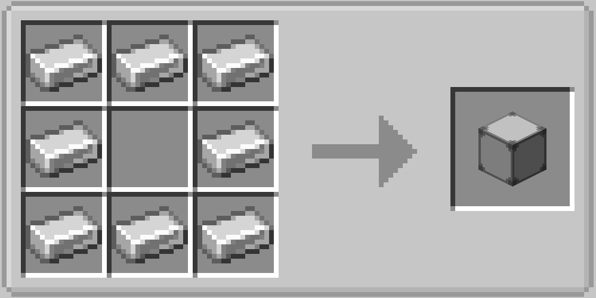 
</div>
</td>
</tr>


<tr>
<td>
<b>Terminal Block</b><br>
Unprogrammed terminal.<br>
Can be programmed using a software item.<br>
4 Iron nuggets<br>
1 Metal Case Block<br>
1 Display<br>
1 Circuit Board<br>
2 Redstone
</td>
<td>
<div align="center">
    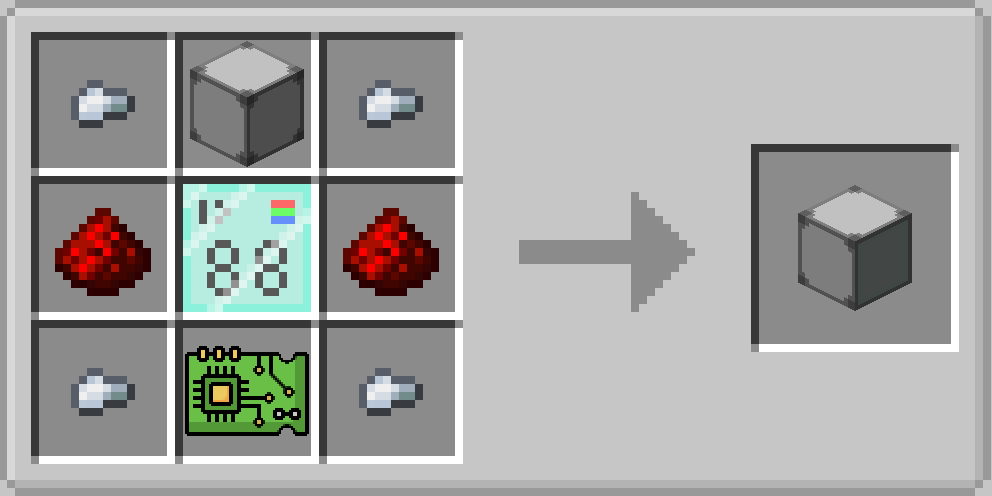 
</div>
</td>
</tr>


<tr>
<td>
<b>Bank Terminal Block</b><br>
Used to get access to the bank account.<br>
Interaction using right click.<br>
Right click on a <b>Terminal Block</b> using a <b>Banking Software</b> to create this block.
</td>
<td>
<div align="center">
    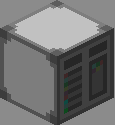 
</div>
</td>
</tr>
</table>

---
## Items
<table>
<tr>
<td>
<b>Circuit Board</b><br>
Electronics for other Items.<br>
1 Nether Quartz<br>
3 Copper Ingots<br>
3 Paper<br>
</td>
<td>
<div align="center">
    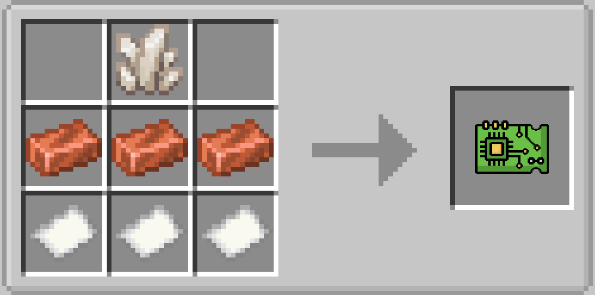 
</div>
</td>
</tr>


<tr>
<td>
<b>Display</b><br>
Display for the <b>Terminal Block</b><br>
6 Glass Planes<br>
2 Iron Ingots<br>
1 Ciruit Board
</td>
<td>
<div align="center">
    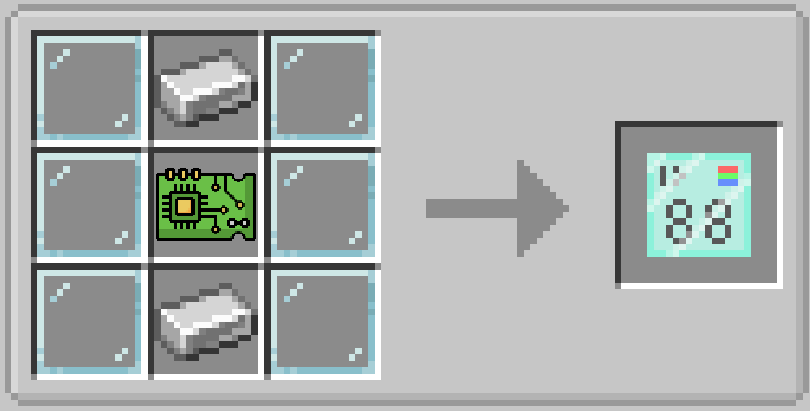 
</div>
</td>
</tr>


<tr>
<td>
<b>Empty Software</b><br>
Used to create a specific software<br>
4 Iron nuggets<br>
2 Ink Sacs<br>
3 Paper
</td>
<td>
<div align="center">
    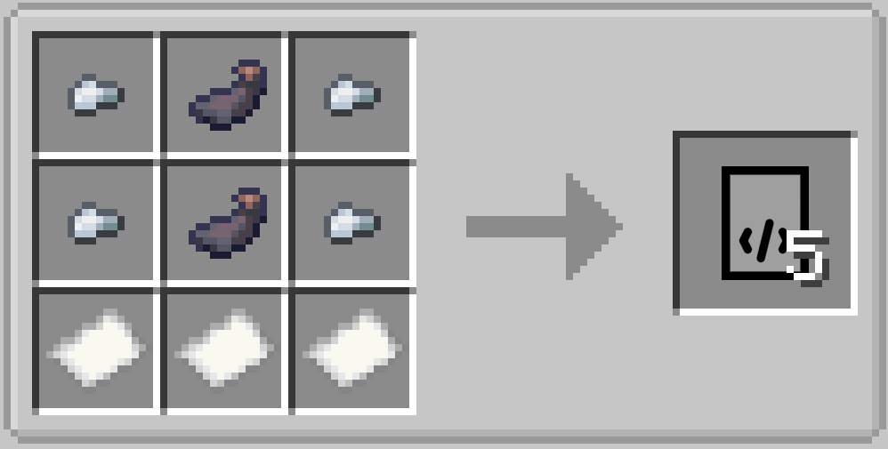 
</div>
</td>
</tr>


<tr>
<td>
<b>Banking Software</b><br>
Used to programm the <b>Terminal Block</b> to be a <b>Bank Terminal Block</b><br>
1 Empty Software<br>
1 Gold Ingot<br>
</td>
<td>
<div align="center">
    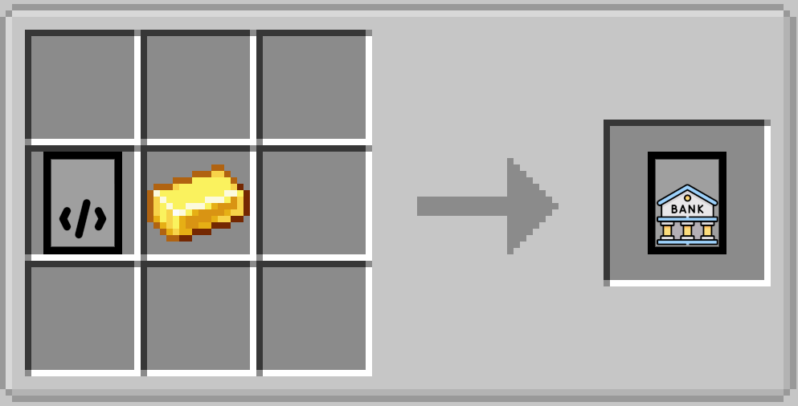 
</div>
</td>
</tr>


<tr>
<td>
<b>1 Dollar</b><br>
A 1 Dollar coin can only be crafted, using other type of money items such as the 5 Dollar bank note.<br>
This puts control over inflation in the hands of the server administrator.<br>
The admin is responsible to bring money in to circulation.<br>
</td>
<td>
<div align="center">
    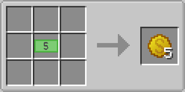 
</div>
</td>
</tr>


<tr>

<td>
<div align="center">
    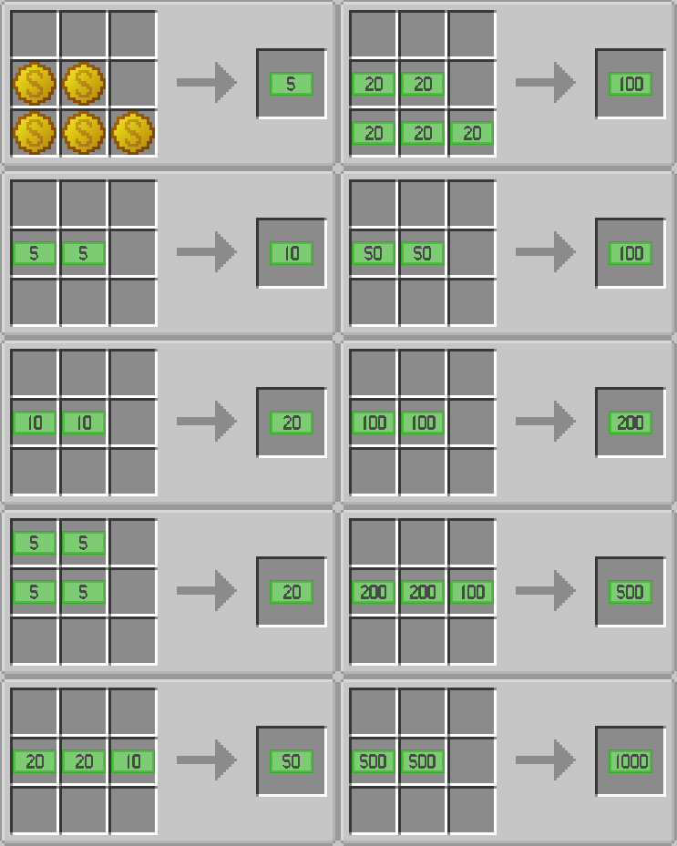 
</div>
</td>
</tr>

</table>

---
## How to use
### For server player / single player
<div align="center">
    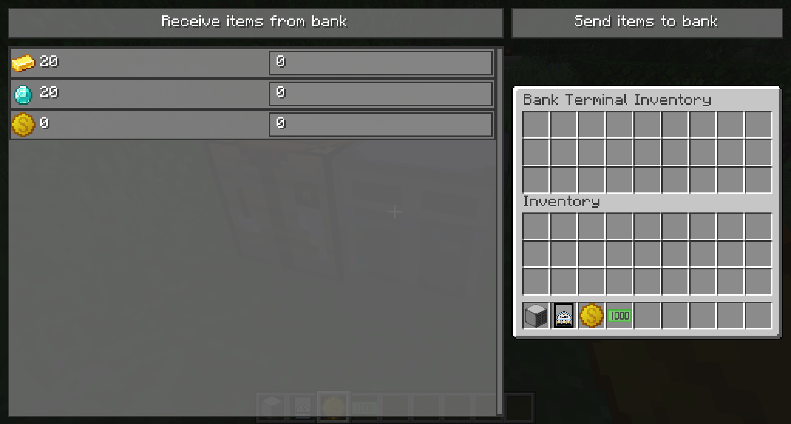 
</div>
<br>

Now open the **Bank Terminal Block** using right click.<br>
This opens a menu which lets you send and receive items/money to your bank account.<br>
Each player has its own bank terminal inventory, other player can not access your items, contained in this block.<br>
If the block gets destroyed, all items which are not transfered to the bank will drop.<br>
It drops all items from all players which let some items in it.<br>

## Send items to the bank
Put your items you want to send to the bank inside the bank terminal inventory and click the **Send items to bank** button.<br>
It takes some time for all items to arrive on your bank acoount.<br>

## Receive items from the bank
Put the amount you want to withdraw in to the textfield next to the item.<br>
Press the **Receive items from bank** button to start the transaction.<br>
It also takes some time for the items to arrive in the bank terminal block.<br>

---
### For Admins / Single Player
#### Managing items for banking
By default only some items can be stored in a bank. To change which items can be used for banking, a Admin can type the following command:
```
/bank settingsGUI
```
<div align="center">
    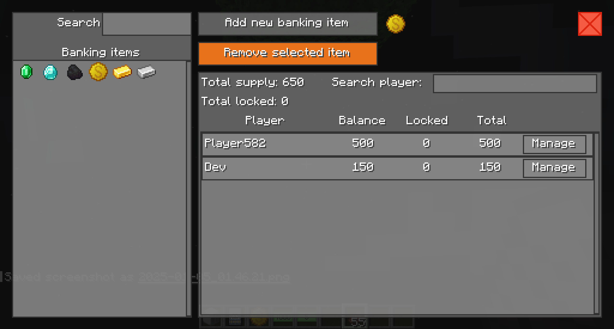 
</div>
<br>

In this window you can add/remove items which can be used for banking.<br>
On the left side is a list of all items that can be stored inside a bank.<br>
Click on a item to get more informations about that item.<br>
On the right side is a overview over the item you have currently selected using the list on the left side.<br>
It shows the total suply, this is the sum of all players bank accounts for that item.<br>
You can also see the sum of [locked amount](#locked-amount) over all players.<br>
Using the **Manage** button on each players display, the [bank account window](#managing-items-for-banking) for that player will be opened.<br>

#### Managing players bank account
Manage players bank account using the GUI. To open the gui, type the following command:
```
/bank <player_name> bankManagementGUI
```
Other ways to open this window:
* clicking on the **Manage** button in the [items management window](#managing-items-for-banking).
* Right click on a player with the **Banking Software**.

<div align="center">
    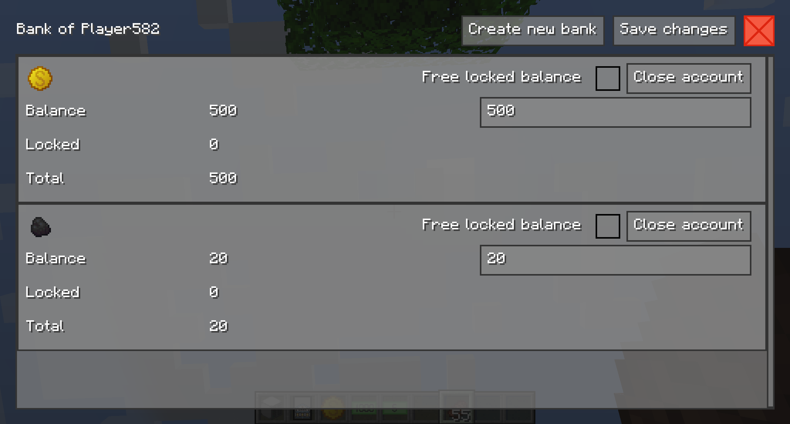 
</div>
<br>

The window shows all items which are currently stored on the players bank account.<br>
<details close> 
    <summary> 
      <b>Add new item</b>
    </summary>
    Click on the <b>Create new bank</b> button and select the item you want to add to the players account.<br>
    The item bank will be created instantly, no need to press the save button.<br>
</details>
<details close> 
    <summary> 
      <b>Remove a item</b>
    </summary>
    If you want to delete a item from the users bank, click on <b>Close account</b>. A deleted account is marked red<br>
    Click the <b>Save changes</b> button to apply your changes.<br>
</details>
<details close> 
    <summary> 
      <b>Change balance</b>
    </summary>
    Change the balance of a specific item using the text field.<br>
    Click the <b>Save changes</b> button to apply your changes.<br>
</details>
<details close> 
    <summary> 
      <b>Release locked amount</b>
    </summary>
    Check the check box if you want to release the locked amount for a specific item. This may affect other mods which have locked the money/item in the first place.<br>
    Click the <b>Save changes</b> button to apply your changes.<br>
</details>

---

## Commands
| Command | Description | Admin only |
|---------|-------------|------------|
| /money                           											| Show balance                                  |  |
| /money add [amount]              											| Add money to self                             | :heavy_check_mark: |
| /money add [user] [amount]       											| Add money to another player                   | :heavy_check_mark: |
| /money set [amount]              											| Set money to self                             | :heavy_check_mark: |
| /money set [user] [amount]       											| Set money to another player                   | :heavy_check_mark: |
| /money remove [amount]           											| Remove money from self                        | :heavy_check_mark: |
| /money remove [user] [amount]    											| Remove money from another player              | :heavy_check_mark: |
| /money send [user] [amount]      											| Send money to another player                  |  |
| /money circulation               											| Show money circulation of all players + bot   |  |
| /bank                                                						| Show bank balance (money and items)      		|  |
| /bank [username] bankManagementGUI                                		| Open the bank [management window](#managing-players-bank-account) for the specific player	| :heavy_check_mark: |
| /bank [username] show                                						| Show bank balance of another player      		| :heavy_check_mark: |
| /bank [username] create [itemID] [amount]            						| Create a bank for another player         		| :heavy_check_mark: |
| /bank [username] setBalance [itemID] [amount]        						| Set balance of a bank for another player 		| :heavy_check_mark: |
| /bank [username] delete [itemID]                     						| Delete a bank for another player         		| :heavy_check_mark: |
| /bank allowItem [itemID]                     						        | Adds the item to the list of bankable items   | :heavy_check_mark: |
| /bank settingsGUI                     						            | Opens the [items management window](#managing-items-for-banking)   | :heavy_check_mark: |


---- 

#### Locked amount
Other mods which access a players bank account may want to reserve some amount for later use. <br>
The [Stock Market Mod](https://github.com/KROIA/StockMarket) for example uses this feature to reserve the amount (money/items) you want to trade. If a trade is not executed immediately the player must wait until the transaction is processed.<br>
To prevent double spending for the time that trade is not executed, the amount gets reserved.<br> 
If you release the locked amount without knowing what mod reserved the amount, may cause problems.<br>