# Bank System Mod

## About
BankSystem is a Minecraft mod that adds a full banking system to the game. Players get a bank account that can hold money and items. Create shared accounts with permissions, automate item transfers with redstone, and monitor balances on in-world displays. Connect multiple servers to share bank accounts across your network.

     

You want to support me? 

---

## Chapters 
* [Features](#features)
* [Installation](#installation)
* [Downloads](#downloads)
* [Usage](#usage)
* [Blocks](#blocks)
* [Items](#items)
* [Commands](#commands)
* [Crafting Recipes](#crafting-recipes)
* [Documentation](#documentation)
* [Changelog](#changelog)

---
## Features
- Bank accounts for money and items with deposit, withdrawal, and transfer support
- Shared bank accounts with per-player permissions (deposit, withdraw, manage)
- ATM block for withdrawing specific bank note denominations
- Bank Upload / Download blocks for redstone-powered automation with hoppers and pipes
- Bank Display blocks that show live balance overviews or history charts
- Money system with coins and bills that can be placed as decorative blocks
- Multi-server support to share bank accounts across connected servers
- Mod API for developers to integrate with the banking system

---
## Installation

1. Install [Architectury API](https://www.curseforge.com/minecraft/mc-mods/architectury-api) and the mod loader API for your platform:
   - **Fabric**: [Fabric API](https://www.curseforge.com/minecraft/mc-mods/fabric-api)
   - **Quilt**: [Quilted Fabric API](https://www.curseforge.com/minecraft/mc-mods/qsl) + [Mod Utilities](https://www.curseforge.com/minecraft/mc-mods/modutilities)
   - **NeoForge / Forge**: No additional API needed
2. Download the BankSystem jar for your Minecraft version and mod loader from [CurseForge](https://www.curseforge.com/minecraft/mc-mods/banksystem) or the [Downloads](#downloads) table below.
3. Place the jar in your `mods/` folder and launch the game.

---
## Downloads
<!--
[CurseForge](https://www.curseforge.com/minecraft/mc-mods/stockmarket)

| Version | Download |
|---------|----------|
|1.3.0    |          |

-->
[CurseForge](https://www.curseforge.com/minecraft/mc-mods/banksystem)
| Minecraft | Fabric | Forge | Quilt | Neoforge |
|-----------|--------|-------|-------|----------|
|     | [][1.4.1-fabric-1.21.1] |                                                                            |                                                                            | [][1.4.1-neoforge-1.21.1] |
|       | [][1.4.1-fabric-1.21]   |                                                                            |                                                                            | [][1.4.1-neoforge-1.21]   |
|     | [][1.4.1-fabric-1.20.6] |                                                                            |                                                                            | [][1.4.1-neoforge-1.20.6] |
|     | [][1.4.1-fabric-1.20.4] | [][1.4.1-forge-1.20.4] | [][1.4.1-quilt-1.20.4] |                                                                               |
|     | [][1.4.1-fabric-1.20.2] | [][1.4.1-forge-1.20.2] | [][1.4.1-quilt-1.20.2] |                                                                               |
|     | [][1.4.1-fabric-1.20.1] | [][1.4.1-forge-1.20.1] | [][1.4.1-quilt-1.20.1] |                                                                               |
|     | [][1.4.1-fabric-1.19.4] | [][1.4.1-forge-1.19.4] |                                                                            |                                                                               |
|     | [][1.4.1-fabric-1.19.3] | [][1.4.1-forge-1.19.3] | [][1.4.1-quilt-1.19.3] |                                                                               |
|     | [][1.4.1-fabric-1.19.2] | [][1.4.1-forge-1.19.2] | [][1.4.1-quilt-1.19.2] |                                                                               |

<!--	Links to Curse1.4.1-forge:	-->
[1.4.1-fabric-1.21.1]:https://www.curseforge.com/minecraft/mc-mods/banksystem/download/6200604
[1.4.1-fabric-1.21]:https://www.curseforge.com/minecraft/mc-mods/banksystem/download/6200596
[1.4.1-fabric-1.20.6]:https://www.curseforge.com/minecraft/mc-mods/banksystem/download/6200590
[1.4.1-fabric-1.20.4]:https://www.curseforge.com/minecraft/mc-mods/banksystem/download/6200584
[1.4.1-fabric-1.20.2]:https://www.curseforge.com/minecraft/mc-mods/banksystem/download/6200573
[1.4.1-fabric-1.20.1]:https://www.curseforge.com/minecraft/mc-mods/banksystem/download/6200133
[1.4.1-fabric-1.19.4]:https://www.curseforge.com/minecraft/mc-mods/banksystem/download/6200127
[1.4.1-fabric-1.19.3]:https://www.curseforge.com/minecraft/mc-mods/banksystem/download/6200121
[1.4.1-fabric-1.19.2]:https://www.curseforge.com/minecraft/mc-mods/banksystem/download/6200108

[1.4.1-forge-1.20.4]:https://www.curseforge.com/minecraft/mc-mods/banksystem/download/6200586
[1.4.1-forge-1.20.2]:https://www.curseforge.com/minecraft/mc-mods/banksystem/download/6200578
[1.4.1-forge-1.20.1]:https://www.curseforge.com/minecraft/mc-mods/banksystem/download/6200135
[1.4.1-forge-1.19.4]:https://www.curseforge.com/minecraft/mc-mods/banksystem/download/6200130
[1.4.1-forge-1.19.3]:https://www.curseforge.com/minecraft/mc-mods/banksystem/download/6200124
[1.4.1-forge-1.19.2]:https://www.curseforge.com/minecraft/mc-mods/banksystem/download/6200111

[1.4.1-quilt-1.20.4]:https://www.curseforge.com/minecraft/mc-mods/banksystem/download/6200588
[1.4.1-quilt-1.20.2]:https://www.curseforge.com/minecraft/mc-mods/banksystem/download/6200581
[1.4.1-quilt-1.20.1]:https://www.curseforge.com/minecraft/mc-mods/banksystem/download/6200137
[1.4.1-quilt-1.19.3]:https://www.curseforge.com/minecraft/mc-mods/banksystem/download/6200126
[1.4.1-quilt-1.19.2]:https://www.curseforge.com/minecraft/mc-mods/banksystem/download/6200112

[1.4.1-neoforge-1.21.1]:https://www.curseforge.com/minecraft/mc-mods/banksystem/download/6200607
[1.4.1-neoforge-1.21]:https://www.curseforge.com/minecraft/mc-mods/banksystem/download/6200602
[1.4.1-neoforge-1.20.6]:https://www.curseforge.com/minecraft/mc-mods/banksystem/download/6200595

---
## Usage

### Bank Terminal Block

     

The Bank Terminal Block is used to deposit/withdraw items to/from the bank account.

> [!NOTE]  
> The block contains an inventory which is unique for every player. 
> Like an ender chest, but when the block gets destroyed, 
> items not stored in the bank account will be dropped.

---
### ATM Block

     

The ATM Block lets you withdraw money as specific bank notes.

---
### Automation Blocks

The **Bank Upload Block** and **Bank Download Block** connect to your bank account and allow automated item transfers via redstone signals. They can be connected to pipes and hoppers.

     

For detailed usage of all blocks, bank accounts, and administration, see the [Documentation](#documentation) section.

---
### Money Stockpile

     

Money items can be placed in the world as decorative blocks. Each denomination has its own block model. The blocks can also be used for physical storage of money outside the banking system.

---
### Bank Displays

The **Bank Display** block shows live bank account data on its screen. Right-click to open the configuration screen, where you select a bank account and one of two display modes:

     

     

| Display Mode | Description |
|--------------|-------------|
| **Balance History** | A line chart tracking balance changes over time for all items in the account. Each item is color-coded with a legend on the right. Updates every 60 seconds. |
| **Balance Overview** | A compact grid showing the current balances of the highest-value items in the account. Displays item icons with their amounts. Updates every second. |

---
## Blocks

| Block | Description |
|-------|-------------|
| **Metal Case Block** | Casing for the Terminal block. |
| **Terminal Block** | Unprogrammed terminal. Can be programmed using a software item. |
| **Bank Terminal Block** | Used to access the bank account. Right click on a **Terminal Block** using a **Banking Software** to create this block. |
| **ATM Block** | Used to withdraw money. Right click on a **Terminal Block** using an **ATM Software** to create this block. |
| **Bank Upload Block** | Sends items to a bank account. Can be connected to pipes and hoppers. Needs redstone power. |
| **Bank Download Block** | Receives items from a bank account. Can be connected to pipes and hoppers. Needs redstone power. |
| **Bank Display** | Displays bank account information on its screen. Can show a balance overview or balance history chart. Right-click to configure. |

---
## Items

| Item | Description |
|------|-------------|
| **Circuit Board** | Electronics component for other items. |
| **Display** | Display for the Terminal Block. |
| **Empty Software** | Base software, used to create specific software variants. |
| **Banking Software** | Programs a Terminal Block into a Bank Terminal Block. |
| **ATM Software** | Programs a Terminal Block into an ATM Block. |
| **Bank Transmitter Module** | Component for the Bank Upload Block. |
| **Bank Receiver Module** | Component for the Bank Download Block. |

### Money

    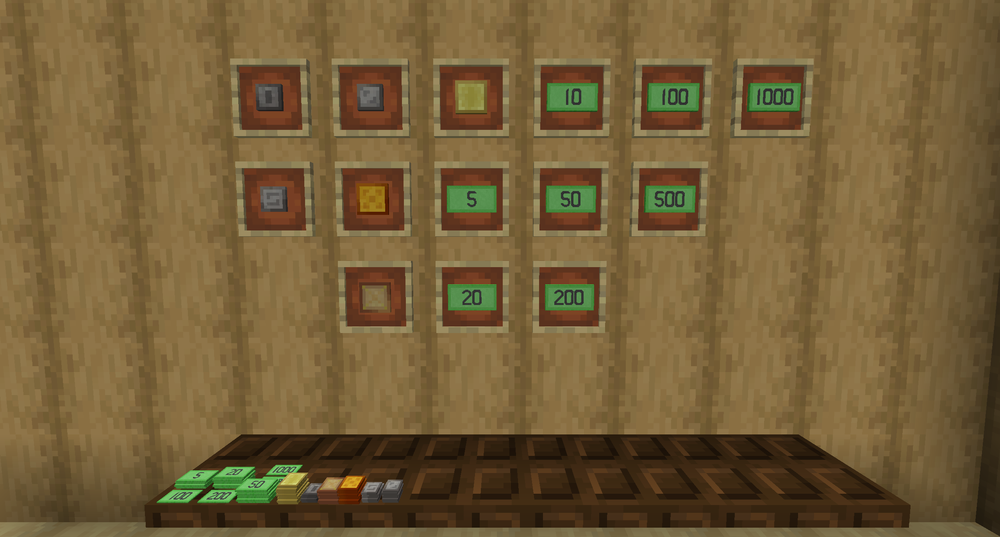 

Money comes in coins ($1-$50) and bills ($5-$1000). All denominations can be converted between each other using the crafting table. Money can also be placed in the world as decorative blocks.
The server administrator controls how money enters circulation.
See [Money Conversions](#money-conversions) for all crafting recipes.

---

## Commands

Key commands for players and admins:

| Command | Description |
|---------|-------------|
| `/money` | Show your money balance |
| `/money send <user> <amount>` | Send money to another player |
| `/bank` | Show your full bank balance (money and items) |
| `/bank manage` | Open the bank account management GUI |
| `/bank create <accountname>` | Create a new bank account |
| `/banksystem manage` | Open the banking settings (admin only) |

For the full command reference, see [Commands](documentation/user-guide/Commands.md).

---

## Documentation

Detailed guides are available in the [documentation](documentation/README.md) folder:

**For Mod Users:**
- [Block Usage](documentation/user-guide/Usage.md) — How to use the Bank Terminal, ATM, automation blocks, bank displays, and money stockpiles
- [Bank Accounts](documentation/user-guide/BankAccounts.md) — Shared accounts, creating accounts, permissions
- [Administration](documentation/user-guide/Administration.md) — Managing banking items, player accounts, locked amounts
- [Multi-Server Setup](documentation/user-guide/MultiserverSetup.md) — Master-slave architecture for cross-server banking
- [Commands](documentation/user-guide/Commands.md) — Full command reference

**For Mod Developers:**
- [API Reference](documentation/developer-guide/API.md) — Public API overview and usage examples
- [Async Forwarding Architecture](documentation/developer-guide/AsyncForwardingArchitecture.md) — Internal RPC system documentation

---

## Crafting Recipes

### Components
<table>
<tr>
<td><b>Empty Software</b></td>
<td><b>Circuit Board</b></td>
<td><b>Display</b></td>
</tr>
<tr>
<td></td>
<td></td>
<td></td>
</tr>
</table>

### Software
<table>
<tr>
<td><b>Banking Software</b></td>
<td><b>ATM Software</b></td>
</tr>
<tr>
<td></td>
<td></td>
</tr>
</table>

### Modules
<table>
<tr>
<td><b>Bank Transmitter Module</b></td>
<td><b>Bank Receiver Module</b></td>
</tr>
<tr>
<td></td>
<td></td>
</tr>
</table>

### Blocks
<table>
<tr>
<td><b>Metal Case Block</b></td>
<td><b>Terminal Block</b></td>
</tr>
<tr>
<td></td>
<td></td>
</tr>
<tr>
<td><b>BankSystem Display Block</b></td>
<td><b>Bank Upload Block</b></td>
</tr>
<tr>
<td></td>
<td></td>
</tr>
<tr>
<td><b>Bank Download Block</b></td>
<td></td>
</tr>
<tr>
<td></td>
<td></td>
</tr>
</table>

### Money Conversions

#### $1
<table>
<tr>
<td>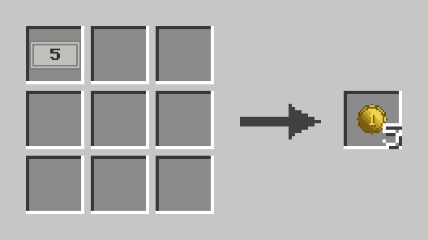</td>
<td>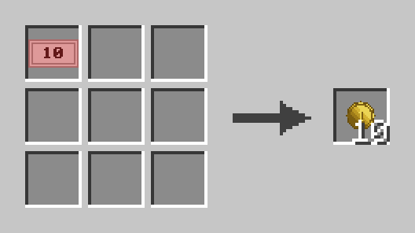</td>
</tr>
<tr>
<td>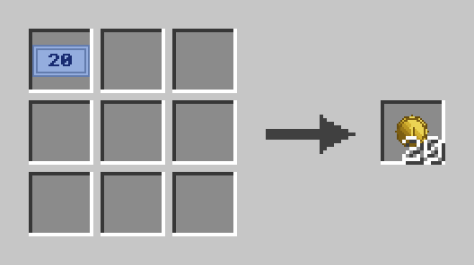</td>
<td>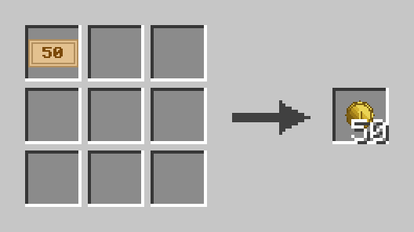</td>
</tr>
</table>

#### $5
<table>
<tr>
<td>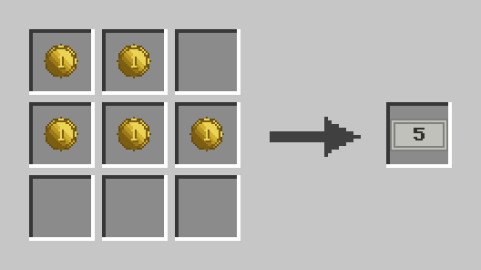</td>
<td>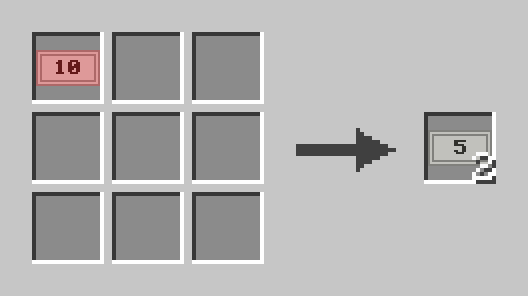</td>
</tr>
<tr>
<td>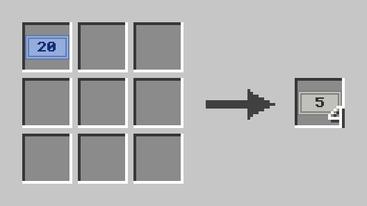</td>
<td>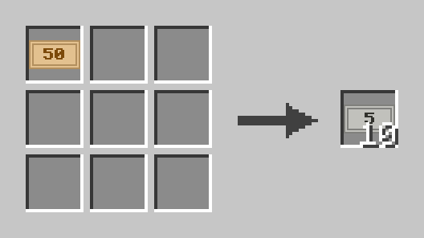</td>
</tr>
<tr>
<td>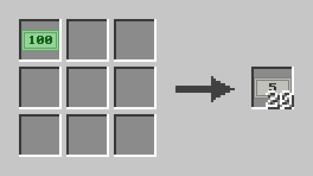</td>
<td></td>
</tr>
</table>

#### $10
<table>
<tr>
<td>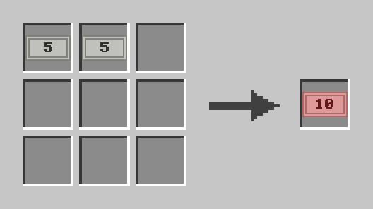</td>
<td>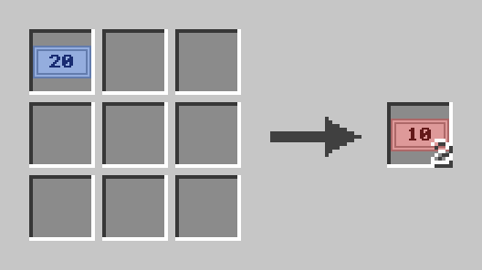</td>
</tr>
<tr>
<td></td>
<td>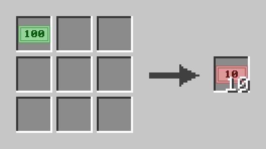</td>
</tr>
<tr>
<td>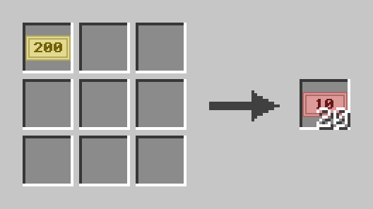</td>
<td>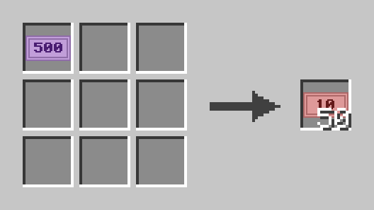</td>
</tr>
</table>

#### $20
<table>
<tr>
<td>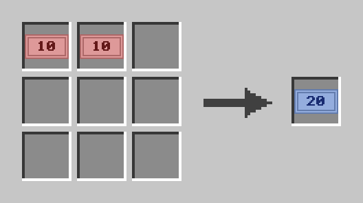</td>
<td>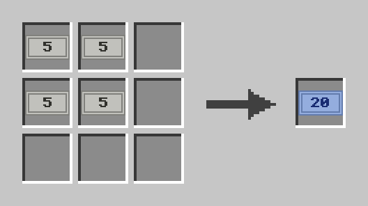</td>
</tr>
<tr>
<td>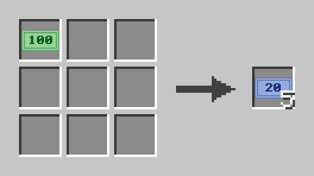</td>
<td>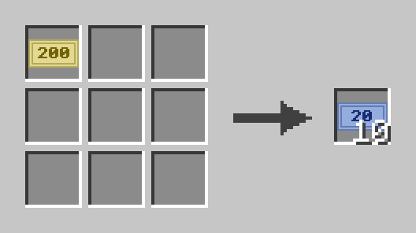</td>
</tr>
<tr>
<td>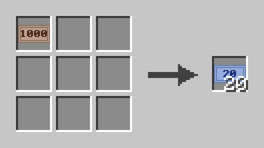</td>
<td></td>
</tr>
</table>

#### $50
<table>
<tr>
<td>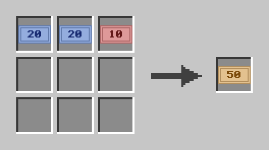</td>
<td>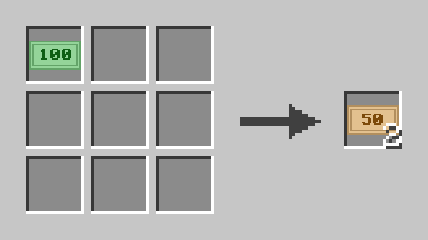</td>
</tr>
<tr>
<td>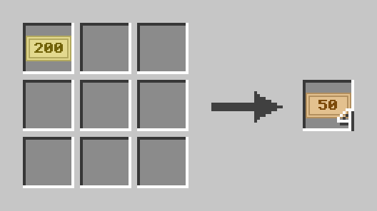</td>
<td>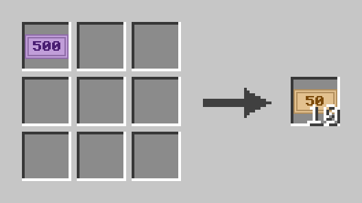</td>
</tr>
<tr>
<td>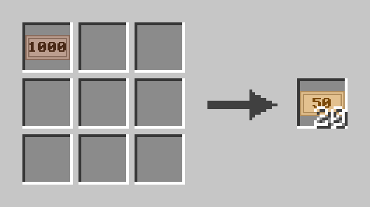</td>
<td></td>
</tr>
</table>

#### $100
<table>
<tr>
<td>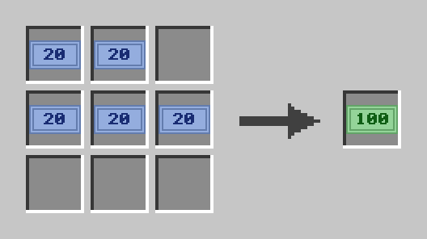</td>
<td>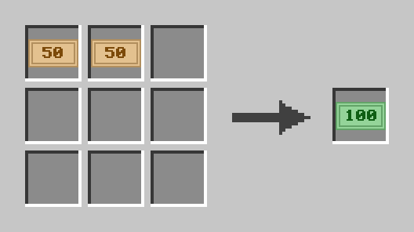</td>
</tr>
<tr>
<td>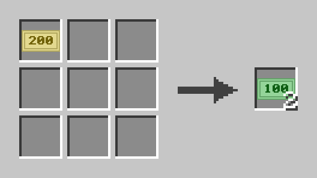</td>
<td>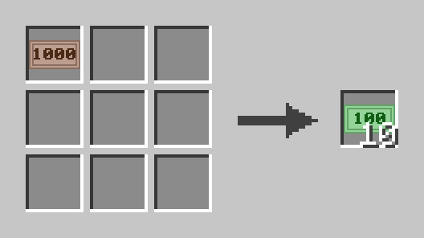</td>
</tr>
</table>

#### $200
<table>
<tr>
<td>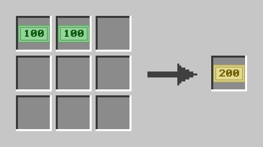</td>
<td>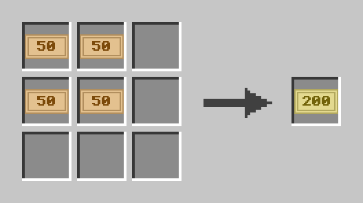</td>
</tr>
<tr>
<td>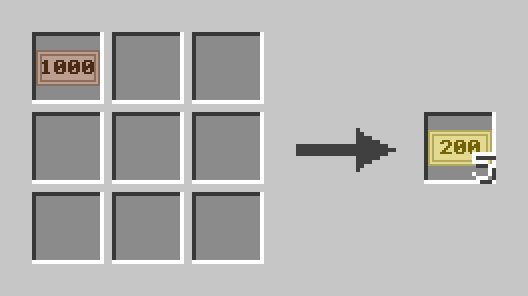</td>
<td></td>
</tr>
</table>

#### $500
<table>
<tr>
<td>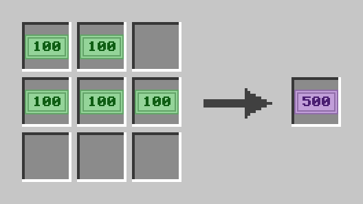</td>
<td>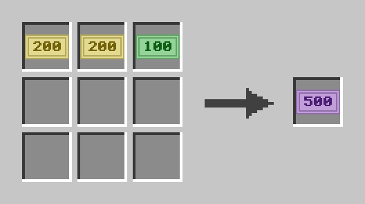</td>
</tr>
<tr>
<td>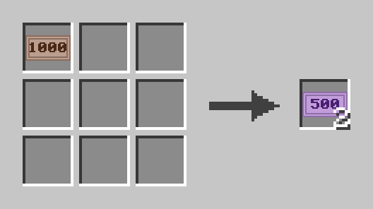</td>
<td></td>
</tr>
</table>

#### $1000
<table>
<tr>
<td>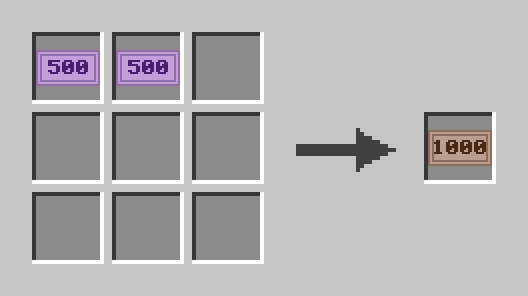</td>
<td>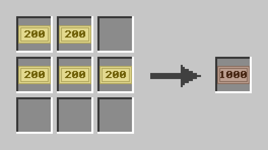</td>
</tr>
</table>

---

## Changelog

All notable changes are documented in version-specific files under `changelog/`.

### Current

- [2.0.2](changelog/v2.0.2.md) — In Development

### Previous

- [2.0.1](changelog/v2.0.1.md) — Released 2026-05-21
- [1.5.0_ALPHA_3](changelog/v1.5.0_ALPHA_3.md) — Security & stability: 50 fixes across permissions, async, concurrency, block entities
- [1.5.0_ALPHA_2](changelog/v1.5.0_ALPHA_2.md) — Trusted slave servers, package reorganization, UI improvements
- 1.5.0_ALPHA_1 — Initial alpha

### Stable

- [1.4.1](changelog/v1.4.1.md) — Stable (CurseForge)
- 1.4.0
- 1.3.0
- 1.2.0
- 1.1.0
- 1.0.0 — Initial release
