# Bank System Mod

## About
BankSystem is a Minecraft mod that brings money in to the game. Players can have a bankacount that can not only hold money but items too.
Admins can define which items can be stored in the bank in order to prevent players from using the bank as infinite storage.

<tr>
<td>

    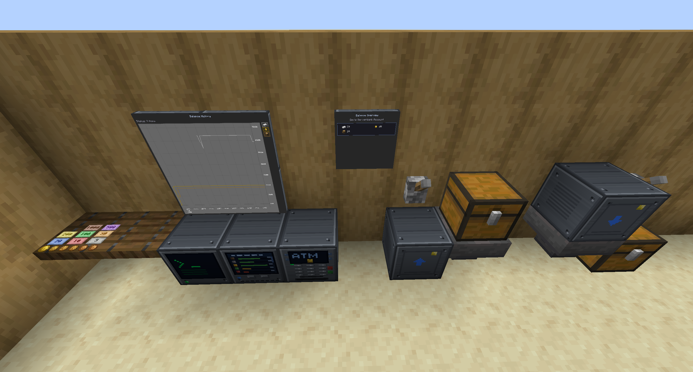 

</td>

You want to support me? 

---

## Chapters 
* [Features](#features)
* [Downloads](#downloads)
* [Blocks](#blocks)
* [Items](#items)
* [Crafting Recipes](#crafting-recipes)
* [Usage](#usage)
* [Commands](#commands)
* [Documentation](#documentation)
* [Changelog](#changelog)

---
## Features
- Adds a banking system to the game for money and items.
- Adds new [blocks](#blocks) to interact with the bank account.
- Money can be placed as a block for decorative and storage purposes.
- Connect multiple servers to share bank accounts across multiple servers.

## Dependencies
- [Architectury](https://www.curseforge.com/minecraft/mc-mods/architectury-api)
- [Quilted Fabric API](https://www.curseforge.com/minecraft/mc-mods/qsl) (Only needed for Quilt)
- [Mod Utilities](https://www.curseforge.com/minecraft/mc-mods/modutilities) (Only needed for Quilt)
- [Fabric API](https://www.curseforge.com/minecraft/mc-mods/fabric-api) (Only needed for Fabric)

---
## Downloads
<!--
[CurseForge](https://www.curseforge.com/minecraft/mc-mods/stockmarket)

| Version | Download |
|---------|----------|
|1.3.0    |          |

-->
[CurseForge](https://www.curseforge.com/minecraft/mc-mods/banksystem)
| Minecraft | Fabric | Forge | Quilt | Neoforge |
|-----------|--------|-------|-------|----------|
|     | [][1.4.1-fabric-1.21.1] |                                                                            |                                                                            | [][1.4.1-neoforge-1.21.1] |
|       | [][1.4.1-fabric-1.21]   |                                                                            |                                                                            | [][1.4.1-neoforge-1.21]   |
|     | [][1.4.1-fabric-1.20.6] |                                                                            |                                                                            | [][1.4.1-neoforge-1.20.6] |
|     | [][1.4.1-fabric-1.20.4] | [][1.4.1-forge-1.20.4] | [][1.4.1-quilt-1.20.4] |                                                                               |
|     | [][1.4.1-fabric-1.20.2] | [][1.4.1-forge-1.20.2] | [][1.4.1-quilt-1.20.2] |                                                                               |
|     | [][1.4.1-fabric-1.20.1] | [][1.4.1-forge-1.20.1] | [][1.4.1-quilt-1.20.1] |                                                                               |
|     | [][1.4.1-fabric-1.19.4] | [][1.4.1-forge-1.19.4] |                                                                            |                                                                               |
|     | [][1.4.1-fabric-1.19.3] | [][1.4.1-forge-1.19.3] | [][1.4.1-quilt-1.19.3] |                                                                               |
|     | [][1.4.1-fabric-1.19.2] | [][1.4.1-forge-1.19.2] | [][1.4.1-quilt-1.19.2] |                                                                               |

<!--	Links to Curse1.4.1-forge:	-->
[1.4.1-fabric-1.21.1]:https://www.curseforge.com/minecraft/mc-mods/banksystem/download/6200604
[1.4.1-fabric-1.21]:https://www.curseforge.com/minecraft/mc-mods/banksystem/download/6200596
[1.4.1-fabric-1.20.6]:https://www.curseforge.com/minecraft/mc-mods/banksystem/download/6200590
[1.4.1-fabric-1.20.4]:https://www.curseforge.com/minecraft/mc-mods/banksystem/download/6200584
[1.4.1-fabric-1.20.2]:https://www.curseforge.com/minecraft/mc-mods/banksystem/download/6200573
[1.4.1-fabric-1.20.1]:https://www.curseforge.com/minecraft/mc-mods/banksystem/download/6200133
[1.4.1-fabric-1.19.4]:https://www.curseforge.com/minecraft/mc-mods/banksystem/download/6200127
[1.4.1-fabric-1.19.3]:https://www.curseforge.com/minecraft/mc-mods/banksystem/download/6200121
[1.4.1-fabric-1.19.2]:https://www.curseforge.com/minecraft/mc-mods/banksystem/download/6200108

[1.4.1-forge-1.20.4]:https://www.curseforge.com/minecraft/mc-mods/banksystem/download/6200586
[1.4.1-forge-1.20.2]:https://www.curseforge.com/minecraft/mc-mods/banksystem/download/6200578
[1.4.1-forge-1.20.1]:https://www.curseforge.com/minecraft/mc-mods/banksystem/download/6200135
[1.4.1-forge-1.19.4]:https://www.curseforge.com/minecraft/mc-mods/banksystem/download/6200130
[1.4.1-forge-1.19.3]:https://www.curseforge.com/minecraft/mc-mods/banksystem/download/6200124
[1.4.1-forge-1.19.2]:https://www.curseforge.com/minecraft/mc-mods/banksystem/download/6200111

[1.4.1-quilt-1.20.4]:https://www.curseforge.com/minecraft/mc-mods/banksystem/download/6200588
[1.4.1-quilt-1.20.2]:https://www.curseforge.com/minecraft/mc-mods/banksystem/download/6200581
[1.4.1-quilt-1.20.1]:https://www.curseforge.com/minecraft/mc-mods/banksystem/download/6200137
[1.4.1-quilt-1.19.3]:https://www.curseforge.com/minecraft/mc-mods/banksystem/download/6200126
[1.4.1-quilt-1.19.2]:https://www.curseforge.com/minecraft/mc-mods/banksystem/download/6200112

[1.4.1-neoforge-1.21.1]:https://www.curseforge.com/minecraft/mc-mods/banksystem/download/6200607
[1.4.1-neoforge-1.21]:https://www.curseforge.com/minecraft/mc-mods/banksystem/download/6200602
[1.4.1-neoforge-1.20.6]:https://www.curseforge.com/minecraft/mc-mods/banksystem/download/6200595

---
## Blocks
<table>
<tr>
<td>
<b>Metal Case Block</b> 
Casing for the Terminal block. 
8 Iron ingots
</td>
<td>

    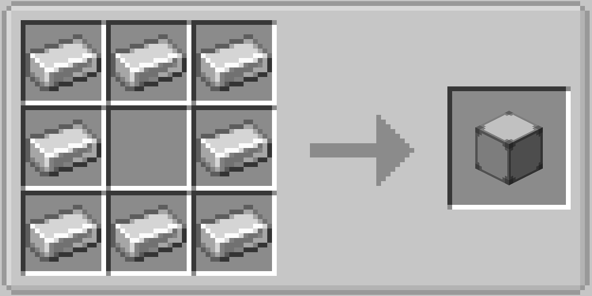 

</td>
</tr>

<tr>
<td>
<b>Terminal Block</b> 
Unprogrammed terminal. 
Can be programmed using a software item. 
4 Iron nuggets 
1 Metal Case Block 
1 Display 
1 Circuit Board 
2 Redstone
</td>
<td>

    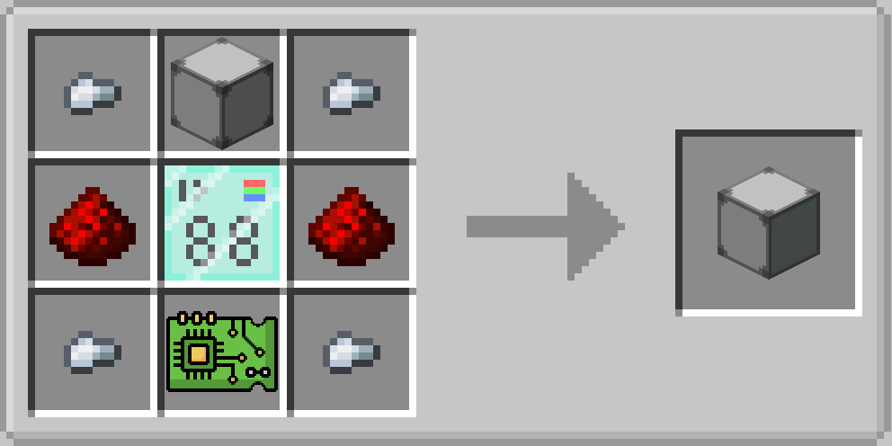 

</td>
</tr>

<tr>
<td>
<b>Bank Terminal Block</b> 
Used to get access to the bank account. 
Interaction using right click. 
Right click on a <b>Terminal Block</b> using a <b>Banking Software</b> to create this block.
</td>
<td>

    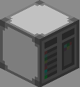 

</td>
</tr>

<tr>
<td>
<b>ATM Block</b> 
Used to withdraw money. 
Interaction using right click. 
Right click on a <b>Terminal Block</b> using a <b>ATM Software</b> to create this block.
</td>
<td>

    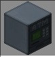 

</td>
</tr>

<tr>
<td>
<b>Bank Upload Block</b> 
Used to send items to a specified bank account. 
Change its settings by right clicking on it 
Once the block is connected to a bank account, other players can't access it any more. 
Can be connected to Pipes and hoppers. 
Needs to be powered by redstone to send items to the bank. 
6 Iron nuggets 
1 Metal Case Block 
1 Comparator 
1 Bank Transmitter Module 
</td>
<td>

    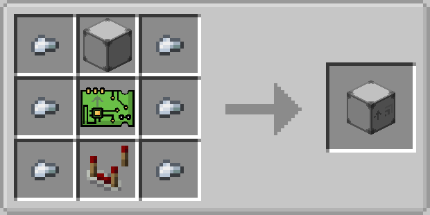 

</td>
</tr>

<tr>
<td>
<b>Bank Download Block</b> 
Used to receive items from a specified bank account. 
Change its settings by right clicking on it 
Once the block is connected to a bank account, other players can't access it any more. 
Can be connected to Pipes and hoppers. 
Needs to be powered by redstone to receive items to the bank. 
6 Iron nuggets 
1 Metal Case Block 
1 Comparator 
1 Bank Receiver Module 
</td>
<td>

     

</td>
</tr>
</table>

---
## Items
<table>
<tr>
<td>
<b>Circuit Board</b> 
Electronics for other Items. 
1 Nether Quartz 
3 Copper Ingots 
3 Paper 
</td>
<td>

    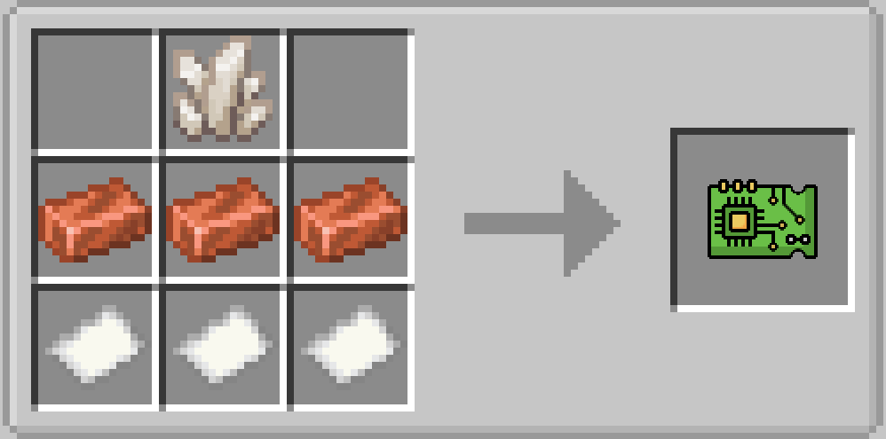 

</td>
</tr>

<tr>
<td>
<b>Display</b> 
Display for the <b>Terminal Block</b> 
6 Glass Planes 
2 Iron Ingots 
1 Ciruit Board
</td>
<td>

    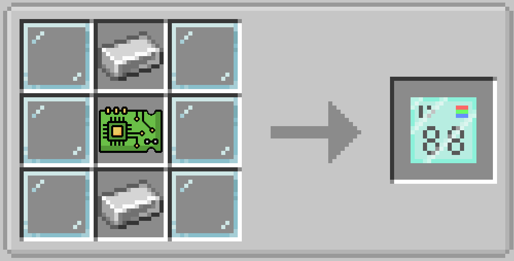 

</td>
</tr>

<tr>
<td>
<b>Empty Software</b> 
Used to create a specific software 
4 Iron nuggets 
2 Ink Sacs 
3 Paper
</td>
<td>

    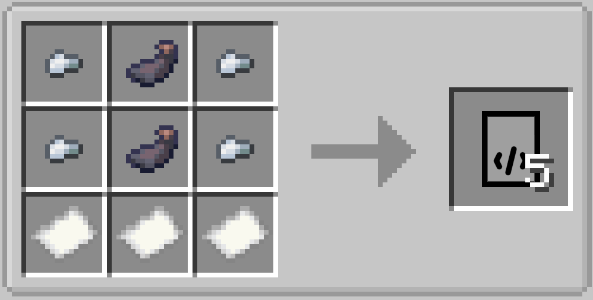 

</td>
</tr>

<tr>
<td>
<b>Banking Software</b> 
Used to programm the <b>Terminal Block</b> to be a <b>Bank Terminal Block</b> 
1 Empty Software 
1 Gold Ingot 
</td>
<td>

    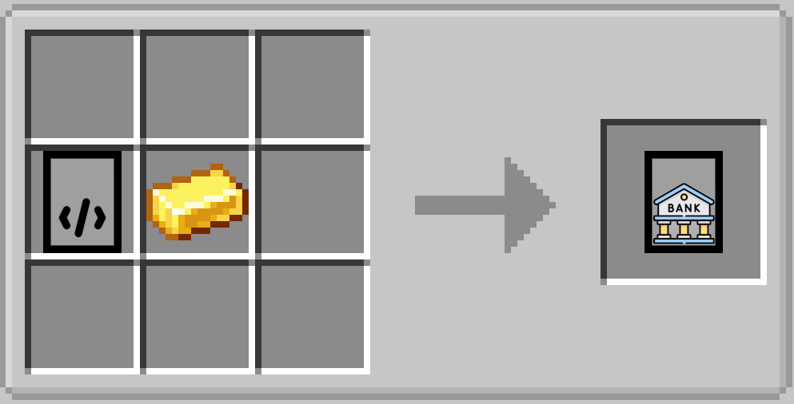 

</td>
</tr>

<tr>
<td>
<b>ATM Software</b> 
Used to programm the <b>Terminal Block</b> to be a <b>ATM Block</b> 
1 Empty Software 
1 Dispenser 
</td>
<td>

    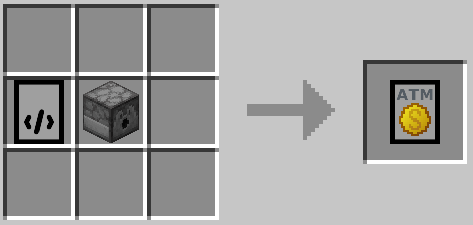 

</td>
</tr>

<tr>
<td>
<b>Bank Transmitter Module</b> 
Used to craft the <b>Bank Upload Block</b>. 
1 Iron ingot 
1 circuit Board 
</td>
<td>

    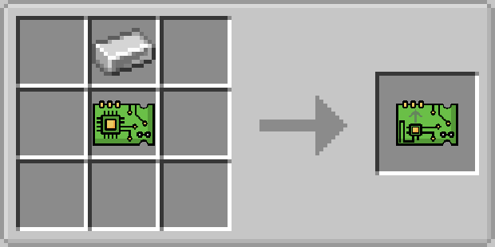 

</td>
</tr>

<tr>
<td>
<b>Bank Receiver Module</b> 
Used to craft the <b>Bank Download Block</b>. 
1 Iron ingot 
1 circuit Board 
</td>
<td>

    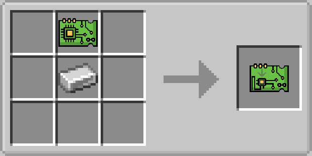 

</td>
</tr>

<tr>
<td>
<b>1 Dollar</b> 
A 1 Dollar coin can only be crafted, using other type of money items such as the 5 Dollar bank note. 
This puts control over inflation in the hands of the server administrator. 
The admin is responsible to bring money in to circulation. 
</td>
<td>

    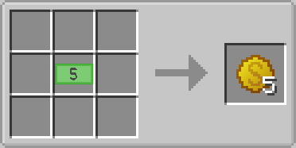 

</td>
</tr>

<tr>

<td>

    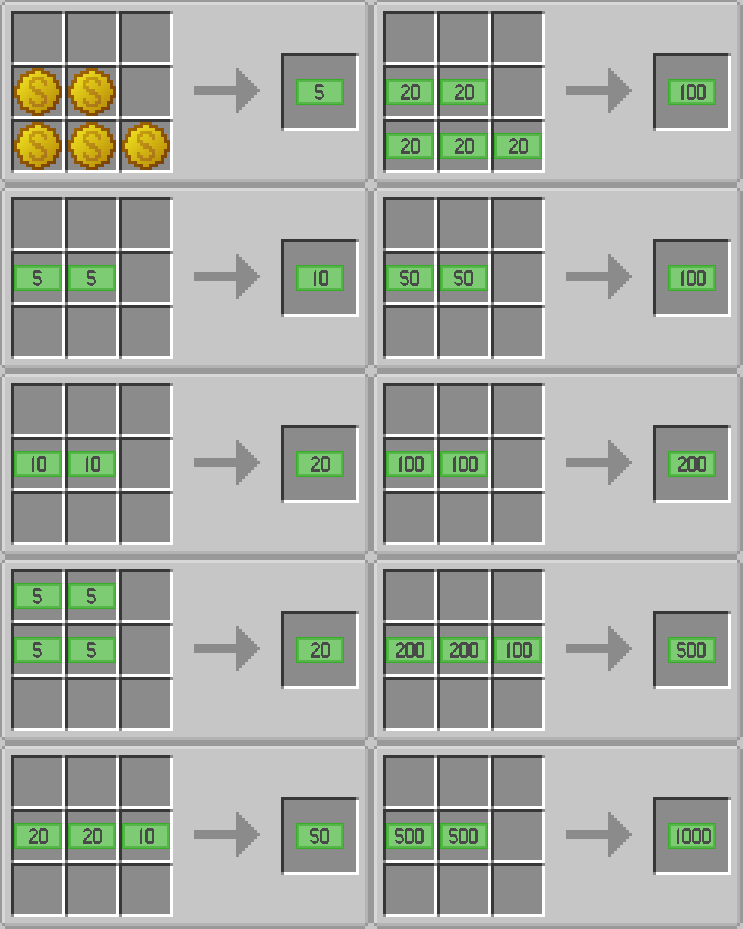 

</td>
</tr>

</table>

---
## Crafting Recipes

### Components
<table>
<tr>
<td><b>Empty Software</b></td>
<td><b>Circuit Board</b></td>
<td><b>Display</b></td>
</tr>
<tr>
<td>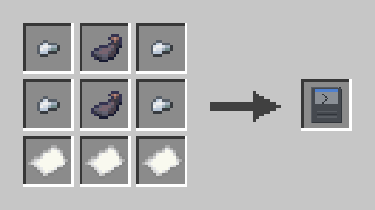</td>
<td>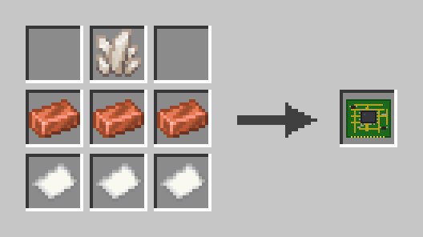</td>
<td>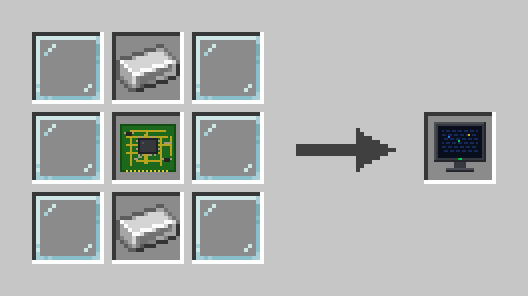</td>
</tr>
</table>

### Software
<table>
<tr>
<td><b>Banking Software</b></td>
<td><b>ATM Software</b></td>
</tr>
<tr>
<td>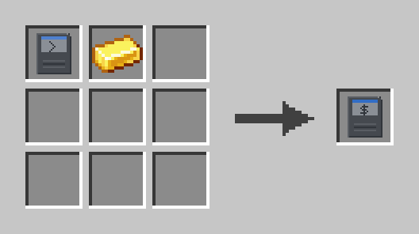</td>
<td>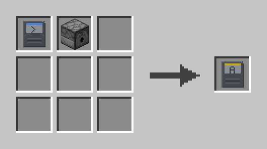</td>
</tr>
</table>

### Modules
<table>
<tr>
<td><b>Bank Transmitter Module</b></td>
<td><b>Bank Receiver Module</b></td>
</tr>
<tr>
<td>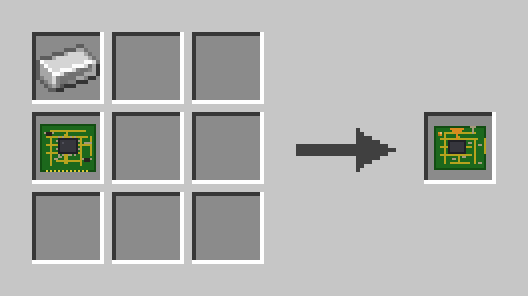</td>
<td>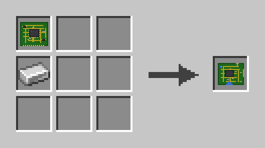</td>
</tr>
</table>

### Blocks
<table>
<tr>
<td><b>Metal Case Block</b></td>
<td><b>Terminal Block</b></td>
</tr>
<tr>
<td>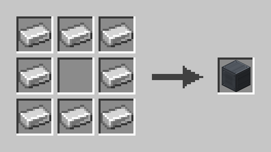</td>
<td>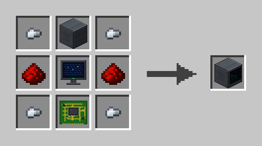</td>
</tr>
<tr>
<td><b>BankSystem Display Block</b></td>
<td><b>Bank Upload Block</b></td>
</tr>
<tr>
<td>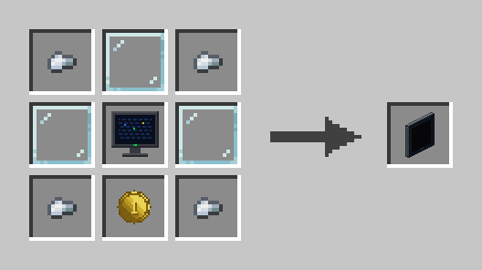</td>
<td>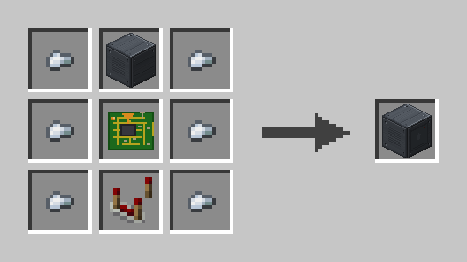</td>
</tr>
<tr>
<td><b>Bank Download Block</b></td>
<td></td>
</tr>
<tr>
<td></td>
<td></td>
</tr>
</table>

---

## Usage

### Bank Terminal Block
<table>
<tr>
<td width = 500 valign="top">
The Bank Terminal Block is used to deposit/withdraw items to/from the bank account.

> [!NOTE]  
> The block contains an inventory which is unique for every player. 
> Like an ender chest, but when the block gets destroyed, 
> items not stored in the bank account will be dropped.

</td>
<td width = 600>

     

</td>
</tr>
</table>

### ATM Block
<table>
<tr>
<td width = 500 valign="top">
The ATM Block lets you withdraw money as specific bank notes.
</td>
<td width = 600>

     

</td>
</tr>
</table>

### Automation Blocks

The **Bank Upload Block** and **Bank Download Block** connect to your bank account and allow automated item transfers via redstone signals. They can be connected to pipes and hoppers.

     

For detailed usage of all blocks, bank accounts, and administration, see the [Documentation](#documentation) section.

---

## Commands

Key commands for players and admins:

| Command | Description |
|---------|-------------|
| `/money` | Show your money balance |
| `/money send <user> <amount>` | Send money to another player |
| `/bank` | Show your full bank balance (money and items) |
| `/bank manage` | Open the bank account management GUI |
| `/bank create <accountname>` | Create a new bank account |
| `/banksystem manage` | Open the banking settings (admin only) |

For the full command reference, see [Commands](documentation/user-guide/Commands.md).

---

## Documentation

Detailed guides are available in the [documentation](documentation/README.md) folder:

**For Mod Users:**
- [Block Usage](documentation/user-guide/Usage.md) — How to use the Bank Terminal, ATM, and automation blocks
- [Bank Accounts](documentation/user-guide/BankAccounts.md) — Shared accounts, creating accounts, permissions
- [Administration](documentation/user-guide/Administration.md) — Managing banking items, player accounts, locked amounts
- [Multi-Server Setup](documentation/user-guide/MultiserverSetup.md) — Master-slave architecture for cross-server banking
- [Commands](documentation/user-guide/Commands.md) — Full command reference

**For Mod Developers:**
- [API Reference](documentation/developer-guide/API.md) — Public API overview and usage examples
- [Async Forwarding Architecture](documentation/developer-guide/AsyncForwardingArchitecture.md) — Internal RPC system documentation

---

## Changelog

All notable changes are documented in version-specific files under `changelog/`.

### Current

- [2.0.1](changelog/v2.0.1.md) — In Development

### Previous

- [1.5.0_ALPHA_3](changelog/v1.5.0_ALPHA_3.md) — Security & stability: 50 fixes across permissions, async, concurrency, block entities
- [1.5.0_ALPHA_2](changelog/v1.5.0_ALPHA_2.md) — Trusted slave servers, package reorganization, UI improvements
- 1.5.0_ALPHA_1 — Initial alpha

### Stable

- [1.4.1](changelog/v1.4.1.md) — Stable (CurseForge)
- 1.4.0
- 1.3.0
- 1.2.0
- 1.1.0
- 1.0.0 — Initial release
