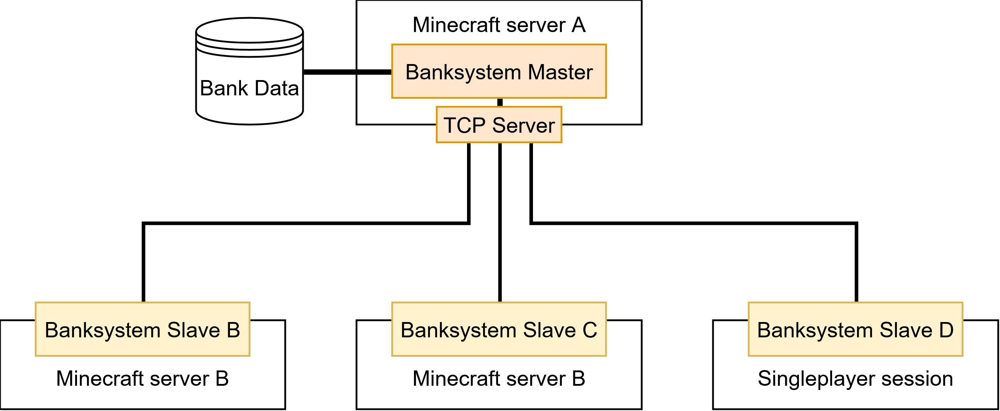

# Multiserver capability

<tr>
<td>
<div align="center">
     
    <figcaption><b>Master-Slave Architecture</b></figcaption>
</div>
</td>


This mod is capable to connect multiple minecraft servers together and share the banking system including the bankaccounts. A Master-Slave architecture is used when this feature is enabled.
The master contains the core logic for the banking system and the slave servers use async interfaces to connect over the network to the master banking system server.


---
<table>
<tr>
<td>
<b>Master</b><br>
The master manages and stores the bank accounts of each player including players that are online on the slave servers.
</td>
<td>
<b>Slave</b><br>
The slave server needs to be connected to a master in order to be able to use the bank system. 
A slave always forwards bank system requests to the master for processing.
No bank data is stored on a slave server!
</td>
</tr>
</table>


---
## Setup a Master
Use the configuration file found at the location: **ServerFolder\config\MultiServerConfig.json**<br>
``` Json
{
  "enable": true,                       
  "isMaster": true,
  "sharedSecret": "change-me-please",
  "slaveID": "",
  "masterHost": "",
  "masterTcpPort": 25575
}
```
- **enable**: Enables/Disables the Multiserver feature. If disabled the server manages the bank accounts on its own and slaves can not connect to it. 
If disabled, all following settings are irrelevant.
- **isMaster**: Specifies if this server is a master or a slave.
- **sharedSecret**: Defines a string that is needed in order to be able for slaves to connect to the master.
The master only accepts slaves that share the same **secret** string. Change this in order to make sure only trusted slaves can connect to the server!
- **slaveID** Ignored for a Master
- **masterHost**: Ignored for a Master
- **masterTcpPort**: The port on which the master listens.

---
## Setup a Slave
Use the configuration file found at the location: **ServerFolder\config\MultiServerConfig.json**<br>

``` Json
{
  "enable": true,
  "isMaster": false,
  "sharedSecret": "change-me-please",
  "slaveID": "slave_server_1",
  "masterHost": "127.0.0.1",
  "masterTcpPort": 25575
}
```
- **enable**: Enables/Disables the Multiserver feature. If disabled the server manages the bank accounts on its own and slaves can not connect to it. 
If disabled, all following settings are irrelevant.
- **isMaster**: Specifies if this server is a master or a slave.
- **sharedSecret**: Defines a string that is needed to match with the string from the master in order to be able to connect to the master.
- **slaveID** Unique identifier string for the specific slave server. Each slave must have a different slave ID
- **masterHost**: The address of the master to connect to.
- **masterTcpPort**: The port on which the master listens.