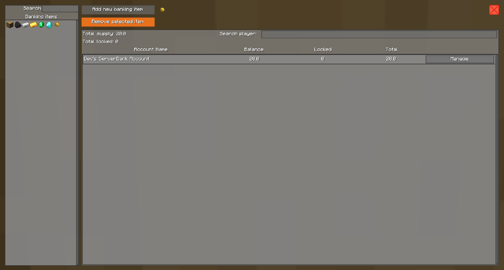
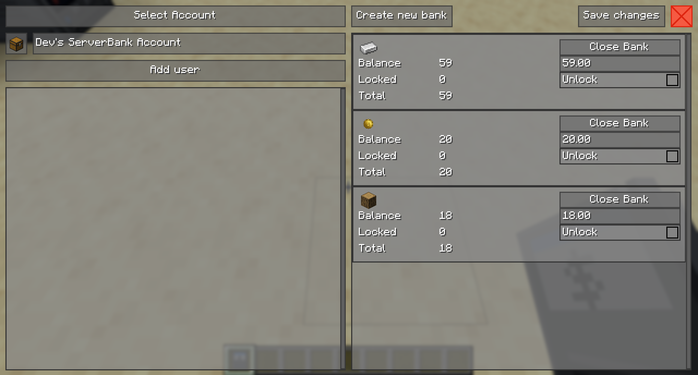

# Administration Guide

This guide is for server administrators and single-player worlds.

## Managing Banking Items

By default only money items can be stored in a bank. To change which items can be used for banking, an admin can open the settings GUI:
```
/banksystem manage
```

<div align="center">
     
</div>
<br>

In this window you can add/remove items which can be stored in the bank.

- **Left side**: A list of all items that can be stored inside a bank. Click on an item to see details.
- **Right side**: Overview of the selected item showing the total supply (sum of all players' balances) and the total locked amount across all players.
- **Manage button**: Opens the [player account management](#managing-player-bank-accounts) window for the selected player.

Items can also be added/removed via commands:
```
/banksystem allowItem <itemID>
/banksystem allowItemInHand
/banksystem disallowItem <itemID>
/banksystem disallowItemInHand
```

> [!WARNING]
> Disallowing an item removes the item bank from **all** player accounts. This action cannot be undone.

---
## Managing Player Bank Accounts

To manage a specific player's bank account, use one of the following methods:

- Command: `/bank <player_name> manage`
- Click the **Manage** button in the [settings GUI](#managing-banking-items).
- Right-click on a player with the **Banking Software** item.

<div align="center">
     
</div>
<br>

The window shows all items currently stored in the player's bank account.

<details>
<summary><b>Add new item</b></summary>
Click on the <b>Create new bank</b> button and select the item you want to add to the player's account.<br>
The item bank will be created instantly, no need to press the save button.
</details>

<details>
<summary><b>Remove an item</b></summary>
If you want to delete an item from the user's bank, click on <b>Close account</b>. A deleted account is marked red.<br>
Click the <b>Save changes</b> button to apply your changes.
</details>

<details>
<summary><b>Change balance</b></summary>
Change the balance of a specific item using the text field.<br>
Click the <b>Save changes</b> button to apply your changes.
</details>

<details>
<summary><b>Release locked amount</b></summary>
Check the checkbox if you want to release the locked amount for a specific item. This may affect other mods which have locked the money/item in the first place.<br>
Click the <b>Save changes</b> button to apply your changes.
</details>

---
## Locked Amounts

Other mods that access a player's bank account may reserve some amount for later use.

The [Stock Market Mod](https://github.com/KROIA/StockMarket) for example uses this feature to reserve the amount (money/items) for pending trades. If a trade is not executed immediately, the player must wait until the transaction is processed. To prevent double spending during this time, the amount gets locked.

> [!CAUTION]
> Releasing locked amounts without knowing which mod reserved them may cause problems with pending transactions in those mods.

---
## Server Settings File

BankSystem stores its per-world server configuration in `<world>/data/BankSystem/settings.json` (auto-save interval, balance-history snapshots, starting balance, automation block intervals, and the item component lists described below).

See the [Configuration guide](Configuration.md) for the full annotated reference of every setting, including when the file is created and rewritten by the server.

---
## Volatile Item Components

Some mods attach **time-varying data components** to item stacks — for example TerraFirmaCraft's food-decay timestamp (`tfc:food`) or heat state (`tfc:heat`). Because BankSystem identifies items by their full component data, such components would make identical items look different over time (e.g. every freshly caught fish would count as a "new" item, and stored food templates could rot inside the bank's item registry).

BankSystem therefore strips a configurable set of **volatile component types** from all items before they take part in item identification. Items are stored and compared *without* these components; when an item is handed back to a player, the owning mod re-attaches a fresh component automatically (e.g. TFC food withdrawn from a bank starts with a fresh creation date).

### Deposit-Gated Components

Ignoring a state-carrying component for identification makes differently-aged items fungible inside the bank — which would allow *state laundering*: deposit a rotten TFC food, withdraw a fresh one. To prevent this, a second component set marks components as **deposit-gated**: such items may only be deposited in a condition equivalent to what the bank would hand back (non-fresh TFC food is rejected with a message and stays where it is).

Both sets ship pre-configured for TerraFirmaCraft and can be extended via the settings file or a datapack. See the Configuration guide for the full deep-dive:

- [Configuring the component sets](Configuration.md#configuring-the-component-sets) (config list and datapack routes)
- [Consequences of changing the lists on an existing world](Configuration.md#changing-the-lists-on-an-existing-world)
- [Which components can be listed](Configuration.md#which-components-can-be-listed) and [how to find component ids](Configuration.md#finding-component-ids-for-other-mods)

---
## BankSystem Admin Role

BankSystem has its own admin role separate from Minecraft's operator system. Server operators can promote/demote BankSystem admins:

```
/banksystem op <player>
/banksystem deop <player>
```

BankSystem admins can manage banking items and access other players' bank accounts without needing Minecraft operator status.
