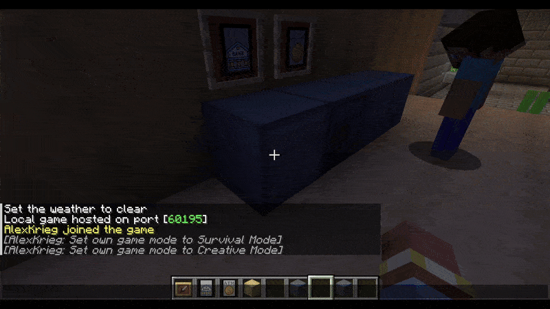
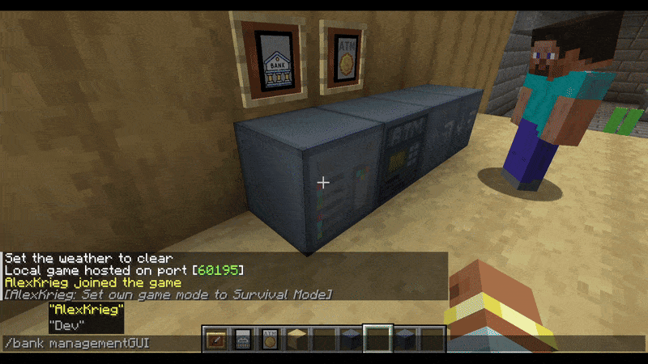

# Bank Accounts

## Personal Bank Account

Every player has one personal bank account that is created automatically. Personal bank accounts cannot be deleted.

## Creating a New Bank Account

<div align="center">
     
</div>

A player can create additional bank accounts using the command:

```
/bank create <accountname>
```

After the bank has been created, the management GUI opens automatically.


---
## Shared Bank Accounts

<div align="center">
     
</div>

A player can add other players to their bank account through the management GUI.
Open it using the command:

```
/bank manage
```

Permissions for each player can be configured individually:

- **Allowed to deposit**: The player can deposit items to the bank account.
- **Allowed to withdraw**: The player can use items from the bank account.
- **Allowed to manage**: The player can:
   - Add or remove other players.
   - Change permissions of other players.
   - Change the account name.
   - Change the account icon.
   - Delete the account.

> [!NOTE]
> Only manually created bank accounts can be deleted. The personal bank account cannot be deleted.

---
## Selecting a Bank Account

When a player has access to multiple bank accounts (personal + shared), they can select which account to use. The Bank Terminal and other blocks operate on the currently selected account.

Use the command to manage a specific account:
```
/bank manage <accountname>
```
