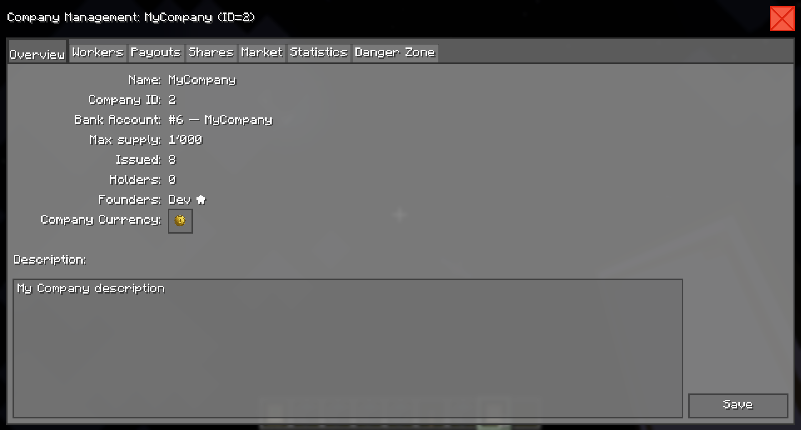
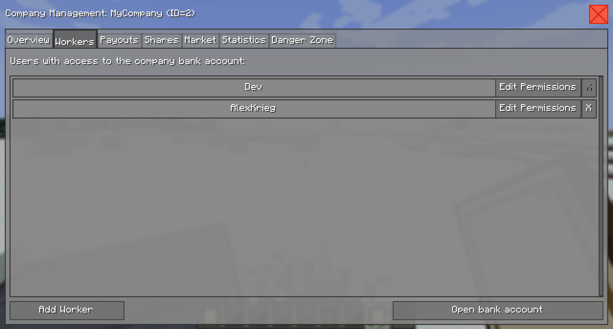
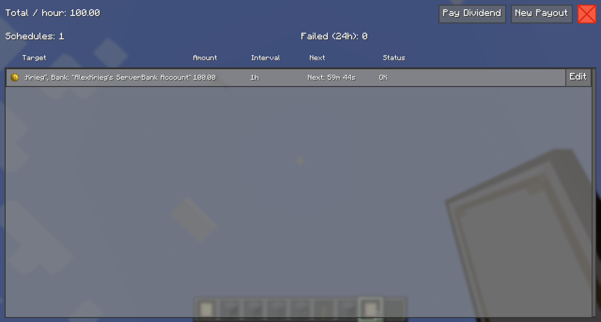
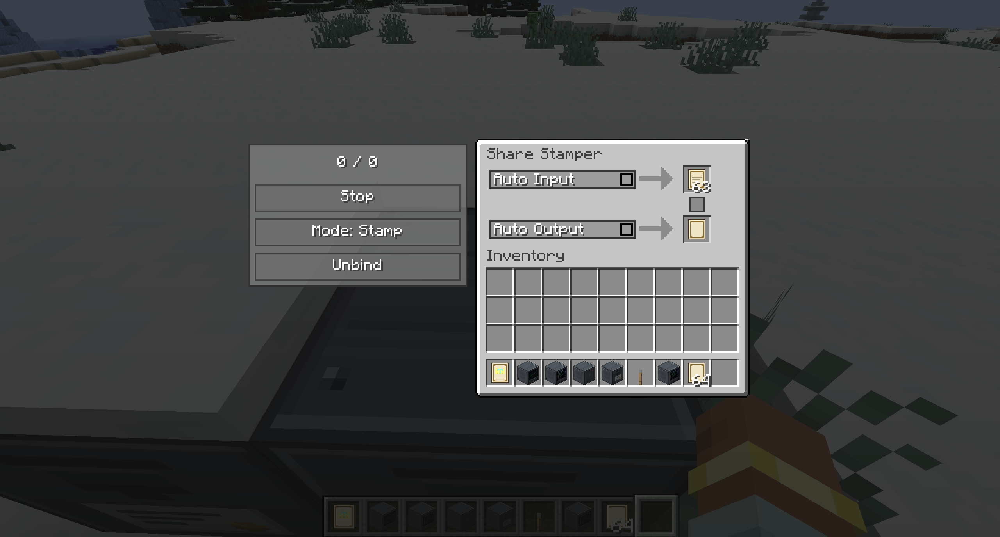
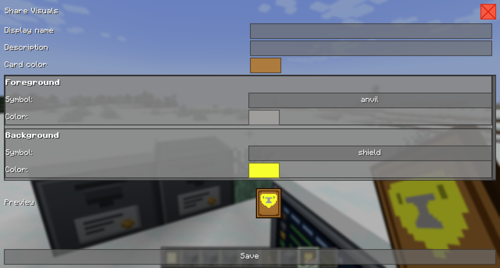

# Companies

A **company** is a shared business owned by one or more founders. It has its own bank account, its own workers, its own physical **shares** that players can hold and trade, and it can pay its people on a timer or hand out dividends to everybody who owns a share.

Everything a company does is done through three things:

- the `/company` commands,
- the **Company Management** screen (seven tabs),
- the **Share Stamper** block, which turns Blank Shares into physical company shares.

> [!NOTE]
> On a multi-server setup, companies live on the **master** server. Slave servers forward `/company` commands to the master automatically, but Share Stamper blocks and the symbol commands only work on the master. See [Multi-server notes](#multi-server-notes).

---

## Founding a company

Any player can found a company:

```
/company create "<name>" <maxSupply>
```

- `<name>` — the company name. Quote it if it contains spaces. Names are unique, ignoring upper/lower case.
- `<maxSupply>` — the maximum number of shares that may ever exist, between `1` and `1000000000`. **This can never be changed afterwards.**

Creating a company does three things at once:

1. A new **bank account** is created with the same name as the company.
2. You are given the `MANAGE` permission on that account.
3. You become the company's **founder**.

The chat confirms with the new company ID, the bank account number and the max supply.

| Message | Meaning |
|---|---|
| `Created company #2 'MyCompany' bound to bank account 6 (maxSupply=1000).` | Success. |
| `Failed to create company 'MyCompany': NAME_TAKEN` | Another company already uses that name. Pick a different one. |
| `Failed to create company 'MyCompany': INVALID_NAME` | The name was blank. |
| `Failed to create bank account for company 'MyCompany'.` | The bank account could not be created — usually a server-side problem; check the server log. |

---

## The bound bank account

The company's bank account is where all company money and all company items live. There is no separate "company wallet":

- Dividends are paid **out of** that account.
- Recurring payouts are paid **out of** that account.
- Sales of stamped shares on the market pay **into** the seller's account, not the company's.
- Anything you can do with a normal shared account — deposits, withdrawals, upload/download blocks, currency bindings — works on it too.

Because it is a normal shared account, you manage it exactly like any other: see [Bank Accounts](BankAccounts.md).

> [!NOTE]
> Dissolving a company does **not** delete the bank account. It stays behind as an ordinary multi-user account, with all its money intact.

---

## Founders and workers

There are two levels of authority.

**Founders** are the company's owners. The founder set is stored on the company itself, not on the bank account. A founder:

- can transfer the founder role and dissolve the company (Danger Zone),
- can close a share market permanently,
- **can never lose `MANAGE`** on the bound bank account. Any permission edit that would strip a founder's `MANAGE` bit is refused by the server — this is what stops a worker with `MANAGE` from locking the owner out of their own company.

**Workers** are the users on the bound bank account. What a worker may do follows straight from their bank-account permission:

| Permission on the bound account | What it means for the company |
|---|---|
| **Allowed to deposit** | Can pay money/items into the company account. Can receive recurring payouts. |
| **Allowed to withdraw** | Can spend the company's money and take its items. |
| **Allowed to manage** | Full company management: workers, payouts, dividends, share visuals, Share Stamper binding, market creation, description, company currency. |
| *(none)* | Can still look at the company: right-click a stamped share to open the read-only Overview / Shares / Statistics tabs. |

### Transferring the founder role

In the management screen: **Danger Zone → Transfer founder**. The new founder is added and gains `MANAGE` on the bank account, and the old founder is removed and loses `MANAGE` (other permissions are kept). Only a current founder can do this.

---

## Opening the Company Management screen

Two ways in:

- `/company manage "<companyName>"` — requires `MANAGE` on the bound bank account (or BankSystem admin).
- **Right-click a stamped share** in your hand — opens the management screen for that share's company. Anyone can do this; you only see the tabs your rights allow.

The tabs shown depend on who you are:

| Tab | Who sees it | What it is for |
|---|---|---|
| **Overview** | Everyone | Company facts, description, company currency |
| **Workers** | `MANAGE` or founder | Who works here and what they may do |
| **Payouts** | `MANAGE` or founder | Recurring payments and dividends |
| **Shares** | Everyone (editing needs `MANAGE`) | Share card design, bound Share Stampers |
| **Market** | Everyone, only when StockMarket is installed | Open, pause or close the share market |
| **Statistics** | Everyone | Balance, cashflow, shareholders, upcoming payouts |
| **Danger Zone** | Founder only | Transfer founder, dissolve company |

---

### Overview tab

<div align="center">
    
</div>

Read-only rows: **Name**, **Company ID**, **Bank Account** (number and account name), **Max supply**, **Issued**, **Holders**, **Founders** (marked with a ★).

Managers additionally get:

- **Company Currency** — an item button that opens *Choose payout currency*. This sets the default currency used for the company's balance display. Money is the default.
- A description box plus **Save**. The description is what other players read on the company; the *share* description shown in the item tooltip is a separate field in the Share Visuals editor.

To read a company's details without opening any screen:

```
/company info "<companyName>"
```

---

### Workers tab

<div align="center">
    
</div>

Lists every user with access to the company bank account. Each row lets a manager toggle that user's deposit / withdraw / manage permissions, or remove them. Changes are saved to the server immediately.

In the screenshot above, `Dev` is the founder of *MyCompany* and `AlexKrieg` is a worker.

- **Add Worker** opens a player picker. New workers start with *deposit* only.
- **Open bank account** jumps to the full Bank Account Management screen for the bound account.
- Founder rows cannot be removed here — their **X** is greyed out, and hovering it explains why. Use **Danger Zone → Transfer founder** instead.
- Every other worker can be removed at any time. The company keeps its manager because a founder always holds `MANAGE` on the bound account.

> [!NOTE]
> Removing a worker also deletes every recurring payout schedule that was targeting them.

---

### Payouts tab

<div align="center">
    
</div>

Shows a summary panel — **Total / hour**, **Schedules**, **Failed (24h)** — and links into the full **Payouts** list (also reachable from the *Payouts* button in Bank Account Management). Two buttons: **New Payout** and **Pay Dividend**.

The payouts list has one row per schedule with the columns **Target | Amount | Interval | Next | Status**, plus a **Pay Missed** button on any row that has fallen behind.

#### Creating or editing a payout

| Field | Notes |
|---|---|
| **Amount** | Two decimals allowed. In *dividend* mode this is the **total** to split, not the amount per person. |
| **Currency** | Money, or any item the company account holds. Opens *Choose payout currency*. |
| **Interval** | **1 min**, **1 hour**, **1 Minecraft day**, or **Custom** minutes (real-time, minimum 1; 1 minute = 1200 game ticks). |
| **Target** / **Pick target** | Opens a picker for the receiving player **and** which of their bank accounts to pay into. |
| **Dividend - split among shareholders** | Instead of one target, the amount is split among all shareholders proportional to their holdings when the payout fires. The target row disappears. |
| **One-time** + **Execute in (min)** | Pays once after the given number of minutes, then deletes itself. |
| **Paused** | Stops the schedule. Missed runs are *not* accumulated while paused; it resumes at the next interval boundary. |
| **History** | The last executions of this schedule, with **Total paid**. |
| **Delete** | Removes the schedule. |

#### Payout statuses

| Status | What happened |
|---|---|
| **OK** | The last run paid out normally. |
| **Insufficient funds** | The company account did not have enough free money. Locked funds (reserved for open market orders) do not count. |
| **Target not found** | The target player or account no longer exists. |
| **No deposit right** | The target account does not accept deposits from this payout. |
| **Insufficient item balance** | An item-currency payout, and the company does not hold enough of that item. |
| **Paused** | The schedule is paused. |

A failed run does not retry immediately — the schedule advances to its next slot and the missed amount is added to its counter. Use **Pay Missed** to settle the backlog once the account has funds again; if it still cannot pay you get *"The company has insufficient funds to execute this payment."*

> [!NOTE]
> After a server restart every schedule's next run is exactly one full interval away. Progress inside the current interval is not carried over.

#### Paying a dividend now

**Pay Dividend** opens a one-shot payout to everybody holding a stamped share of this company:

1. Pick the **Currency** — money, or an item balance held by the company account.
2. Enter the **Amount per share** (two decimals).
3. Press **Pay**.

The result appears immediately: *"Paid 1,250 to 8 holder(s)."*

Rules worth knowing:

- Every holder is paid `shares × amount per share`.
- The payment is **all or nothing**. If the company cannot afford the full run, nothing is paid and you get *"Insufficient funds — no dividends paid."*
- Only the free balance counts; money locked for open market orders is not available.
- The company's **own** account is always excluded — a company does not pay a dividend to itself.
- If a holder has no bank slot for the payout item yet, one is created for them.
- The screen keeps a **Dividend History** list; press **Refresh** to reload it.

---

### Shares tab

- **Edit Visual Layers** opens the [Share Visuals editor](#designing-the-share-card).
- **Stamper bindings** lists every Share Stamper block bound to this company by coordinates, with an **Unbind** button per row (managers only) and a **Refresh** button.

---

### Market tab

Only present when [StockMarket](https://www.curseforge.com/minecraft/mc-mods/stockmarket) is installed. It has three states:

| State | What you can do |
|---|---|
| *No market exists for this company's shares yet.* | Enter an **Initial price** (the starting price per share) and press **Create Market**. |
| *A market exists for this company's shares.* | **Pause trading** / **Resume trading**. Pausing cancels and refunds every open player order; resuming brings the market back with an empty order book. |
| *Market integration not available.* | StockMarket is not responding — nothing to do here. |

**Close market** is founder-only and permanent: type the exact company name to unlock the button, then confirm. Price history is lost and cannot be restored.

Refusals you may see: *"A market already exists for this share item."*, *"This share item is blacklisted from trading."*, *"No share item found for this company."* (nobody has stamped a share yet), *"You do not have permission to do this."*

---

### Statistics tab

Pick a timeframe — **24h**, **7d**, **30d**, **90d**, **All Time** — and the whole tab re-reads:

| Figure | Meaning |
|---|---|
| **Balance** | Current money balance of the company bank account. |
| **Net Cashflow** | Earnings minus spendings over the selected period. |
| **Solvency** | Estimated real-life days until the balance reaches zero at the current outflow rate and scheduled obligations. Shows **Safe** when nothing is draining. *(Real days, not Minecraft days.)* |
| **Missed Payouts** | Number and total amount of failed payout executions. |

Below that: an earnings/spendings chart over the selected period, a **Top Shareholders** table (Account | Shares | %) and an **Upcoming Payouts** table (Account | Amount).

---

### Danger Zone

Founder-only, and both actions are irreversible.

- **Transfer founder** — choose a player, confirm. You lose your founder privileges immediately, and the screen closes. The picker lists every player BankSystem knows, so you can hand the company to somebody who is currently offline, or who only ever played on another server of the network.
- **Dissolve company** — type the **exact** company name to unlock the button, then confirm. Anything else gives *"The typed name does not match the company name."*

The confirmation reads *"Dissolved company 'MyCompany'. Bank account 6 remains as a multi-user account."* Stamped shares of a dissolved company stay in the world as items, but no longer resolve to a live company.

---

## Issuing physical shares

A share only exists once it has been stamped by a **Share Stamper**.

### 1. Get the materials

| Item | How to get it |
|---|---|
| **Blank Share** | Craft: 1 paper + 1 leather (shapeless) → 4 Blank Shares. |
| **Share Stamper** | Craft it (shaped): iron nuggets in the four corners, a Metal Case top-centre, redstone left and right of a Piston in the middle, and a Circuit Board bottom-centre. |

### 2. Bind the stamper to your company

Place the Share Stamper and right-click it. Because it is not bound yet, the **Bind Share Stamper** screen opens listing every company you manage:

If you manage no companies you get *"You have no companies with MANAGE permission"*.

To unbind later, use **Unbind** in the stamper's own screen, or the stamper list in the company's **Shares** tab.

Once bound, right-clicking the block opens the stamper itself — but only for players with `MANAGE` on that company. Everyone else is told *"Bound to MyCompany — no permission"*. A bound stamper also takes **20× longer to break** for anyone without `MANAGE`, and when it is finally broken the dropped block keeps its binding, so re-placing it re-binds automatically.

### 3. Stamp

<div align="center">
    
</div>

| Control | What it does |
|---|---|
| Supply line | `issued / max supply` for the bound company. |
| **Start** / **Stop** | Starts or stops the stamping/redeeming process. |
| **Mode: Stamp** / **Mode: Redeem** | Stamp turns Blank Shares into company shares; Redeem turns company shares back into Blank Shares. |
| **Unbind** | Clears the block's company binding (contents are kept). |
| **Auto Input** | Allows hoppers to insert into the input slot. |
| **Auto Output** | Allows hoppers to extract from the output slot. |

Put Blank Shares in the **top** slot, press **Start**, and one share is produced every **67 ticks** (about 3.4 seconds), filling the green progress bar between the two slots. Each stamped share raises the company's *Issued* count by one.

The machine **stops itself** and the button flips back to *Start* when:

- the input slot is empty or holds the wrong item,
- the output slot is full or holds something that cannot stack with the result,
- (Stamp mode) the company has reached its **max supply**,
- (Redeem mode) the company has no issued shares left, or the inserted share belongs to a different company.

Only one player can have a stamper open at a time — a second player gets *"Share Stamper is already in use by another player"*.

### 4. Automate it

**Auto Input** and **Auto Output** are independent toggles, both off by default:

- **Auto Input** lets any hopper or pipe insert into the **top** face → the input slot. Only the item the current mode accepts is allowed in (Blank Shares in Stamp mode; shares of *this* company in Redeem mode).
- **Auto Output** lets any hopper or pipe extract from the **bottom** face → the output slot.

Leave **Start** pressed and the block runs continuously as long as items keep arriving. Turning a toggle off does not stop the machine, it only closes that face.

---

## Designing the share card

Open **Shares → Edit Visual Layers**:

<div align="center">
    
</div>

| Field | Effect |
|---|---|
| **Display name** | The item name becomes *"\<Display name\> Share"*. Leave it empty to use the company name. |
| **Description** | Shown on the item tooltip when holding **SHIFT**. |
| **Card color** | Tints the card itself, underneath both symbol layers. |
| **Foreground** — Symbol + Color | The main symbol, drawn on top. |
| **Background** — Symbol + Color | A second symbol drawn behind the foreground. |
| **Preview** | A live stamped share rendered with your unsaved settings. |

Press **Save** to publish. Every player's stamped shares of that company update — the card, the item name and the name colour all follow the visuals.

The finished item tooltip shows the company name, `Supply: <issued> / <max>`, and the description behind **SHIFT**:

### Share symbols (server admins)

Symbols are PNG textures stored per world. BankSystem ships **45** of them; admins can add their own. All symbol commands need permission level 2 **and must be run on the master server**.

| Command | What it does |
|---|---|
| `/banksystem symbols list` | Lists every symbol with its ordinal, hash and file size, plus the current revision. |
| `/banksystem symbols add <id>` | Imports `<world>/banksystem/share_symbols/inbox/<id>.png` into the store. |
| `/banksystem symbols remove <id>` | Deletes a symbol and compacts the ordinals. |
| `/banksystem symbols reload` | Rescans the folder and picks up files changed on disk. |

To add a symbol: drop the PNG into `<world>/banksystem/share_symbols/inbox/` named `<id>.png`, then run `/banksystem symbols add <id>`. The file is validated first:

- id must match `[a-z0-9_]`, 1–32 characters,
- the image must be **square**, its size a **power of two**, at most **64×64**,
- at most **128 KiB** per file, and at most **256 symbols** in total.

Failures are reported inline, e.g. *"PNG validation failed: Must be square (got 64x32)."* or *"Inbox file not found: …"*. Successful changes are pushed to every connected client and mirrored to slave servers automatically, so nobody needs a resource pack.

---

## Multi-server notes

On a master/slave setup ([Multi-Server Setup](MultiserverSetup.md)):

- **Company data lives only on the master.** Slaves keep no company files.
- `/company create`, `transfer`, `dissolve`, `description`, `info` and `manage` all work from a slave — the command is forwarded to the master and the reply is identical on both sides. Name auto-completion is forwarded too.
- **Share Stampers only work on the master.** On a slave, an unbound stamper answers *"Binding is master-only (this is a slave server)"*, and a bound one reports *"no permission"* because the slave cannot see the company. Stampers on slave worlds do not tick.
- `/banksystem symbols …` is master-only; slaves receive the symbol files through the master's sync.
- Stamped shares carried to a slave still show their card and tooltip — the slave mirrors the master's visuals.

---

## Command reference

| Command | Description | Who may run it |
|---|---|---|
| `/company create "<name>" <maxSupply>` | Found a company and its bank account | Any player |
| `/company info "<companyName>"` | Print company details to chat | Any player |
| `/company manage "<companyName>"` | Open the Company Management screen | `MANAGE` on the bound account, or BankSystem admin |
| `/banksystem symbols list\|add <id>\|remove <id>\|reload` | Manage share symbol textures (master only) | Permission level 2 |

The full command list for the rest of the mod is in [Commands](Commands.md).

---

## Troubleshooting

| Message / symptom | What to do |
|---|---|
| `Failed to create company '…': NAME_TAKEN` | The name is already used by another company (comparison ignores case). Choose another name. |
| `No such company '…'.` | Check spelling and quoting — names with spaces must be quoted. Use the tab-completion list. |
| `Only a founder may dissolve company '…'.` / `Only a founder of company '…' can transfer it.` | Only founders can do this. Ask a founder, or have the founder transfer the role to you first. |
| `You need MANAGE on the company's bank account to manage it.` | Have a manager grant you *Allowed to manage* on the bound account (Workers tab). |
| `No known user named '…'.` | BankSystem has never registered that player. Registration happens on first join to any server of the network, so the name must be spelled exactly as it appears in the picker. |
| `Insufficient funds — no dividends paid.` | The company account's **free** balance is below `holders' shares × amount per share`. Top the account up, or lower the amount. Money locked for open market orders does not count. |
| `No accounts hold shares of this company.` | Nobody holds a stamped share of this company in a bank account. Shares sitting in a player inventory or a chest do not count — they must be deposited. |
| `Invalid amount.` on Pay Dividend | The amount must be a positive number with at most two decimals. |
| Payout row shows **Insufficient item balance** | The schedule pays an item currency the company account does not hold enough of. Deposit the item, or switch the schedule's currency. |
| Payout row shows **No deposit right** | The target bank account does not accept the deposit. Re-pick the target account in the payout editor. |
| `The company has insufficient funds to execute this payment.` | Shown when clicking **Pay Missed**. Fund the account and try again. |
| A worker's remove button is greyed out | Either they are a founder (use Danger Zone → Transfer founder), or they are the last non-founder worker on the account. |
| `Share Stamper is already in use by another player` | Somebody else has the block open. Wait for them to close it. |
| `Not bound — right-click to choose a company` | The stamper has no company yet. Right-click it and pick one. |
| `Bound to <company> — no permission` | You do not have `MANAGE` on that company. |
| `Max supply reached (…/…)` — the stamper stops immediately | The company has issued every share it is ever allowed to. Max supply cannot be raised; redeem shares in Redeem mode to free capacity. |
| `You have no companies with MANAGE permission` | You are trying to bind a stamper but manage no company. Found one, or ask to be added with *Allowed to manage*. |
| `Binding is master-only (this is a slave server)` | Place and bind stampers on the master server. |
| `The typed name does not match the company name.` | The dissolve / close-market confirmation needs the **exact** company name, case included. |
| `[symbols] Must run on the master server.` | Run symbol commands on the master. |
| Stamped shares show `company#12` instead of a name | The client has not received the company data yet. It self-heals within a second; if it persists, reconnect. |

---

## Related documentation

- [Bank Accounts](BankAccounts.md) — the account model the company account is built on
- [Usage](Usage.md) — Bank Terminal, ATM, upload/download blocks
- [Currency Bindings](CurrencyBindings.md) — link a company account slot to an external currency mod
- [Multi-Server Setup](MultiserverSetup.md) — master/slave topology
- [Commands](Commands.md) — full command reference
