# Currency Bindings

BankSystem can **link** an item slot on one of your bank accounts to an external currency mod's account. Once a slot is bound, every deposit, withdrawal, or trade routed through BankSystem moves real money on the other mod's side — and their own ATM / Bank Terminal moves the same balance. You do not have to migrate your currency; you just point BankSystem at it.

This guide covers the two currency mods BankSystem ships with adapters for:

- **[Numismatics](https://modrinth.com/mod/numismatics)** (Fabric, NeoForge, Quilt)
- **[Lightman's Currency](https://modrinth.com/mod/lightmans-currency)** (NeoForge only for MC 1.21.1)

If you write your own currency mod and want it to appear in the binding picker, read the [Currency Integration developer guide](../developer-guide/CurrencyIntegration.md) instead.

---

## What a binding does

A binding connects **one item slot** on **one BankSystem account** to **one account inside a currency mod**. After binding:

- The slot's balance shown in BankSystem is read live from the currency mod. If a player deposits coins at a Numismatics Bank Terminal, the BankSystem balance updates the next time it is read.
- Deposits and withdrawals through BankSystem (bank terminal, ATM, bank upload/download blocks) move funds inside the currency mod's account.
- StockMarket buy / sell orders using this account move the currency mod's funds transparently.
- The **locked balance** (used to reserve funds for open StockMarket orders) stays inside BankSystem. External mods do not need to know about it.

You keep BankSystem's account permissions (`DEPOSIT`, `WITHDRAW`, `MANAGE`) and multi-server behavior; the currency mod keeps ownership of the actual money. Bindings are opt-in per slot and per account — nothing binds until you say so, and unbinding restores the slot to normal BankSystem storage.

---

## Prerequisites

1. Install the currency mod on the same loader as BankSystem:

   | Currency mod | Fabric | NeoForge | Quilt |
   |---|:---:|:---:|:---:|
   | Numismatics | ✅ | ✅ | ✅ |
   | Lightman's Currency | ❌ | ✅ | ❌ |

2. On a multi-server setup, install the currency mod on the **master** server. Slaves forward every bank read/write to master via ARRS, so the adapter only needs to be present where BankSystem is authoritative. Client-side install is not required for the adapter itself.
3. Create at least one account on the currency mod's side first — with Numismatics, join the world once (the personal account is auto-created); with Lightman's, right-click any ATM block once.

When the currency mod is loaded, BankSystem automatically pre-creates its base currency slot on every new bank account (`numismatics:spur` for Numismatics, `lightmanscurrency:coin_gold` for Lightman's) so you have a slot ready to bind.

---

## Opening the Bindings screen

Open **Bank Account Management** for the account you want to bind (right-click a Bank Terminal → *Manage*, or use `/bank manage <account>`). A **Bindings** button appears next to *Save Changes*.

    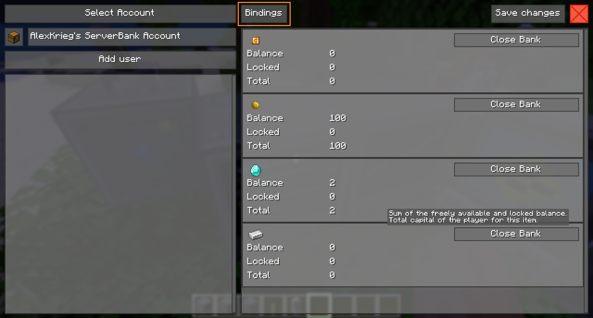

Clicking it opens the Currency Bindings screen. It lists one row per item slot in the account.

    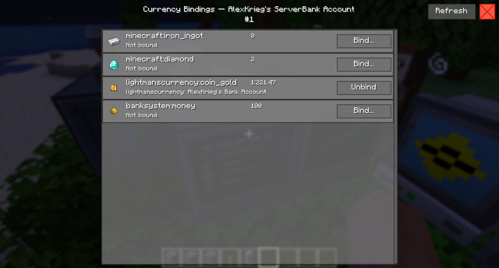

Each row shows:

- The slot's item icon and name.
- The slot's current balance.
- Either **Not bound** with a **Bind…** button, or the provider label (e.g. `numismatics: Personal Account`) with an **Unbind** button.
- A greyed-out row means the provider that owns the binding is not currently loaded on the server — the binding is preserved, but no money moves until the mod comes back.

The **Refresh** button in the top-right re-reads the account, the binding list, and the balance from the external mod. Use it after depositing or withdrawing outside BankSystem to force the screen to catch up.

> [!NOTE]
> The **Bindings** button and every bind/unbind action require the `MANAGE` permission on the account. Non-manager users see the screen in read-only mode: buttons are disabled and hover a "Requires MANAGE permission" tooltip.

---

## Binding a slot

1. Press **Bind…** on the row you want to bind.
2. If more than one currency mod is loaded, pick the provider first:

   

       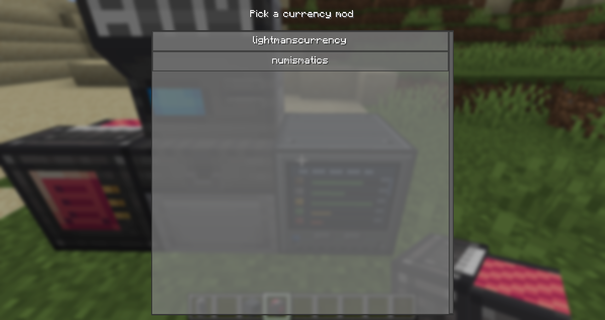
   

   If only one currency mod is loaded, this step is skipped.

3. Pick an account from the provider. The picker only lists external accounts that match the BankSystem account's kind — personal accounts see personal externals, shared accounts see co-owned externals. This is a hard rule enforced by both the client and the server; you cannot mix the two directions.

   Binding from a **personal** BankSystem account → only **personal** external accounts (Numismatics PLAYER accounts, Lightman's per-player accounts):

   

       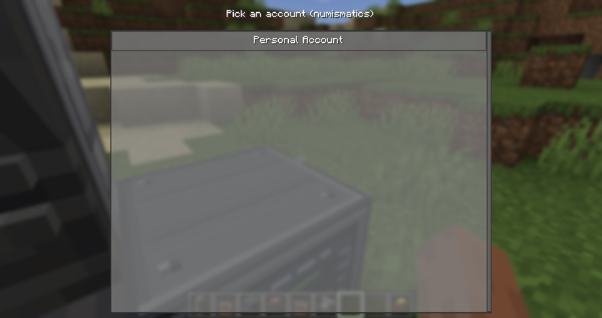
   

   Binding from a **shared** BankSystem account → only **co-owned** external accounts (Numismatics Blaze Bankers you are trusted on, Lightman's team accounts you belong to). Each row carries a `[shared]` badge:

   

       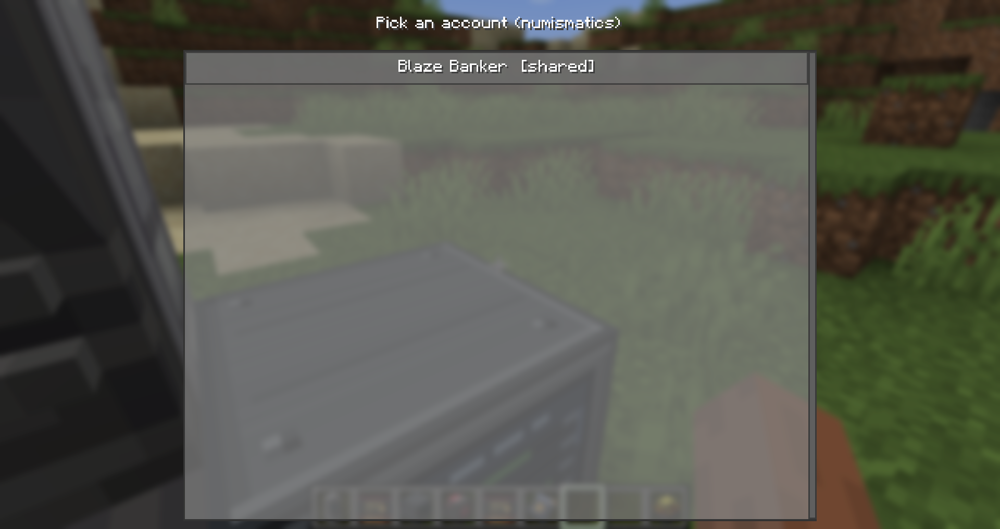
   

   If the account kind you need is missing, create the matching kind first: use `/bank create <name>` to make a shared BankSystem account, or set up a Blaze Banker / Lightman's team on the currency mod's side.

4. A confirmation dialog explains what is about to happen. Any non-zero balance already in the slot is transferred to the external account as part of the bind. Press **Yes** to bind.

   

       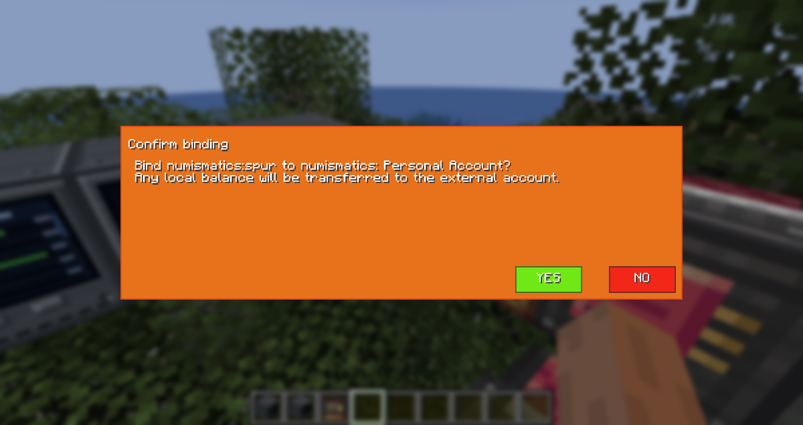
   

5. On success, the row updates to show the provider label and an **Unbind** button.

   

       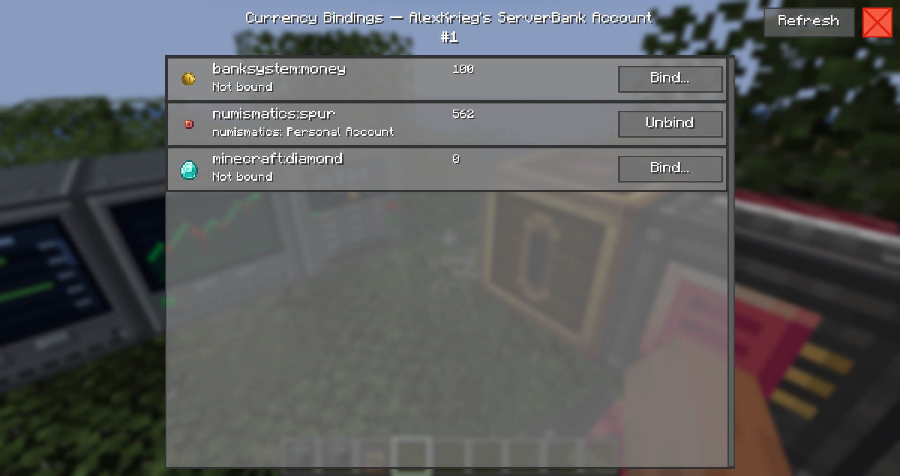
   

### When bind is refused

| Message | Meaning | Fix |
|---|---|---|
| *The slot's item does not match the provider's currency* | You tried to bind, for example, an emerald slot to a Numismatics account. Currency providers only accept binding on their own base currency item. | Bind the provider's canonical slot instead (`numismatics:spur` or `lightmanscurrency:coin_gold`). |
| *The existing balance would overflow the external account* | Numismatics stores balances as 32-bit integers (max ≈ 2.1 billion spurs). Your slot balance would push the external account past that cap. | Withdraw some of the slot balance first, then bind. |
| *Personal and shared accounts cannot be mixed on a binding* | You tried to bind a personal BankSystem account to a shared external account (or vice versa). | Choose an account of the matching kind. |
| *No external currency mods are installed on this server* | No provider is registered. | Install a supported currency mod on the master server. |

    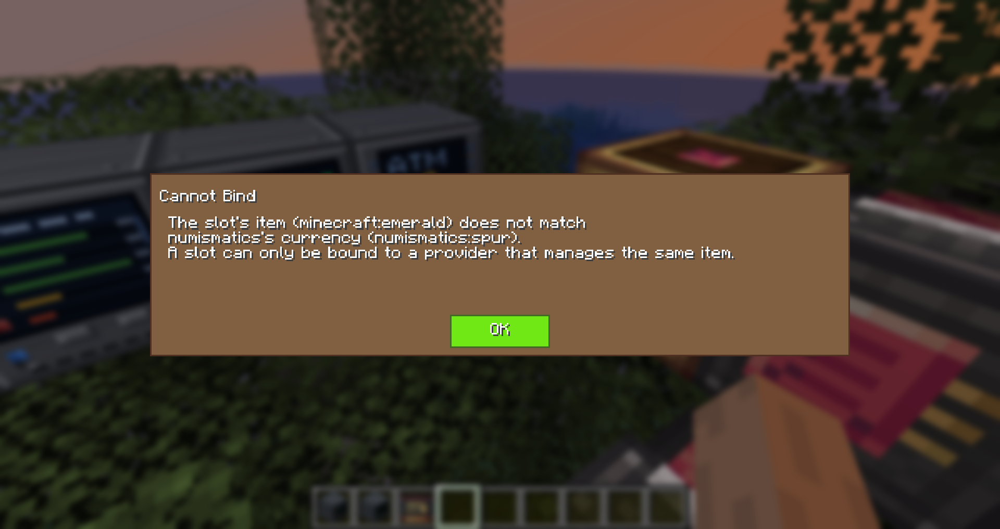

---

## Depositing coin variants

Currency mods usually offer multiple coin denominations. BankSystem accepts every denomination in the chain when you deposit through a bank terminal that is bound to that provider's base currency slot: the coin's face value is added to the bound slot in the base unit.

- **Numismatics:** deposit any of *Spur, Bevel, Sprocket, Cog, Crown, Sun*. The bound `numismatics:spur` slot grows by the coin's value in spurs.

  

      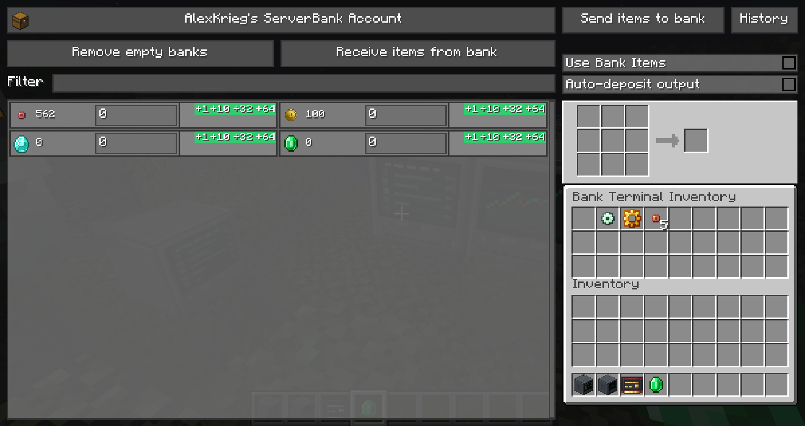
  

- **Lightman's Currency:** deposit any of *Copper, Iron, Gold, Emerald, Diamond, Netherite* (or whatever coins the server's chain configures). The bound `lightmanscurrency:coin_gold` slot grows by the coin's live core value — if a server operator edits `coinvalues.json` to change ratios, BankSystem honours the new number.

  

      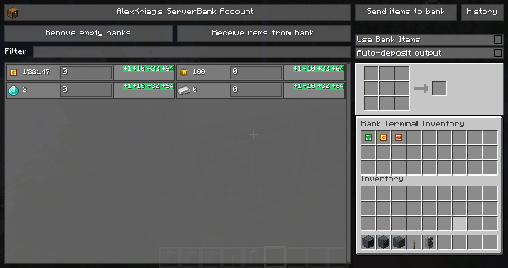
  

Withdrawing coins from a bank terminal or ATM Block returns the value in the provider's smaller denominations, exactly the same as if the currency mod's own ATM had paid out.

> [!NOTE]
> Coin-variant deposits only route into the bound slot. Without a binding, depositing a `numismatics:crown` creates a separate `numismatics:crown` slot in your BankSystem account (regular per-item storage). Binding is what unifies the whole chain into a single balance.

---

## Unbinding

Press **Unbind** on a bound row. A three-way choice appears:

    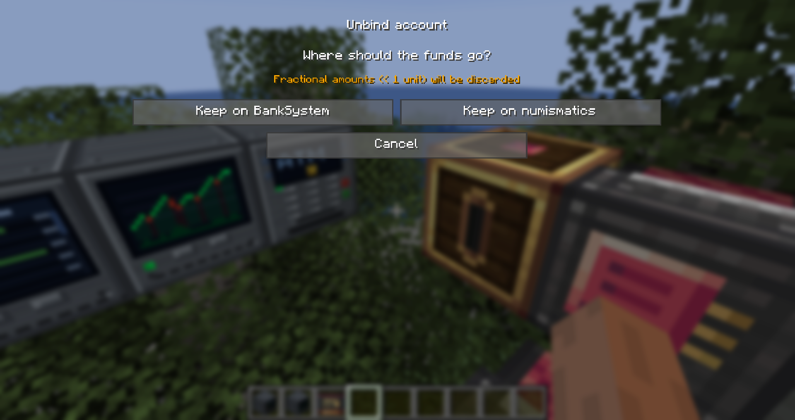, and Cancel">

| Choice | Result |
|---|---|
| **Keep on BankSystem** | The full external balance is withdrawn from the currency mod and stored natively in the BankSystem slot. Use this if you plan to uninstall the currency mod. |
| **Keep on \<provider\>** | The binding is removed but the money stays in the currency mod's account. The BankSystem slot is emptied. Any locked balance is released. A small warning reminds you that fractional amounts below one unit are discarded — this only matters when the provider stores fractional units internally. |
| **Cancel** | Nothing happens. |

Unbind can be refused if **Keep on BankSystem** would cause the BankSystem slot balance to overflow — in that case, choose **Keep on \<provider\>** or withdraw some funds first.

---

## Live behavior notes

- **Reads are always live.** Every time BankSystem reads the slot balance — opening the account screen, running `/money`, placing a StockMarket order — the adapter asks the currency mod directly. There is no cached balance on the server side.
- **The client screen is not push-updated.** If you deposit into the currency mod's own UI while the BankSystem Bindings screen is open, the amount will only show after you press **Refresh** or reopen the screen.
- **Drift is expected.** You can spend the currency mod's balance outside BankSystem — with its own ATM, its own trade shop, an admin `/eco` command, etc. If the external balance drops below what BankSystem thinks is locked (open orders), BankSystem quietly clamps the locked amount to what is actually there and logs a warning. Any StockMarket order that had reserved funds is automatically cancelled/refunded when it next tries to touch the reduced lock.
- **Locking is BankSystem-only.** Lock / unlock operations (used by StockMarket to reserve funds for open orders) do not touch the currency mod. Only actual withdrawals move money externally.
- **Provider missing.** If you uninstall the currency mod but leave a binding in place, the row shows greyed-out. Reads return zero, writes are refused with *"The external currency mod is not available."*. Reinstall the mod and everything reconnects automatically as long as the account still exists on that side.

---

## Numismatics notes

- **PLAYER** accounts (personal, one owner) only appear in the picker when you are binding from a **personal** BankSystem account.
- **BLAZE_BANKER** accounts (co-owned, backed by a trust list) only appear when binding from a **shared** BankSystem account, and only if you are on their trust list. They carry a `[shared]` badge.
- When you bind a **shared** BankSystem account, every user of that account with the `WITHDRAW` permission is added to the Blaze Banker's trust list, and updates propagate whenever you change the user list. Users with only `DEPOSIT` or `MANAGE` are not added — they cannot spend the linked account from Numismatics's own UI.
- **32-bit cap.** Numismatics stores balances as `int` (max ≈ 2,147,483,647 spurs). Any deposit that would push the total above that returns *insufficient funds* on the BankSystem side, and no money moves. Split the deposit or use multiple Blaze Bankers.

## Lightman's Currency notes

- **NeoForge only** for MC 1.21.1. The adapter registers itself automatically when LC is loaded and does nothing on Fabric / Quilt.
- Public API exposes personal accounts and team-owned (shared) accounts. Team accounts appear in the picker with the `[shared]` badge and can be bound from shared BankSystem accounts.
- **Team membership is not synchronised.** Because LC's public API does not expose a team-membership mutator, BankSystem does not push its user list into LC's team. Add/remove members using LC's own team commands as normal — the binding continues to work with whatever member set LC has.
- **No simulate primitive.** LC's public API does not offer a "check-if-withdraw-would-succeed" call. BankSystem asks for the balance and attempts the real withdrawal; if the balance moved in the meantime, the withdrawal fails cleanly and BankSystem surfaces the reject.
- **Ratios follow the live config.** Coin values are read from LC's runtime chain data at every deposit, so any admin change to `coinvalues.json` (after a restart) is honoured immediately.

---

## Troubleshooting

| Symptom | Where to look |
|---|---|
| The **Bindings** button is missing from Bank Account Management. | You do not have `MANAGE` on the account. Ask the account owner. |
| The Bindings screen opens but every row says *No external currency mods are installed on this server*. | The currency mod is not loaded on the master, or it failed to start. Check `logs/latest.log` on the master for `[Numismatics]` or `[Lightman's]` `WARN` lines during startup. |
| A Blaze Banker you own is missing from the picker. | Numismatics's `GlobalBankManager` may have changed shape. Check the log for `Failed to enumerate BLAZE_BANKER accounts` — that means the reflection lookup failed and the adapter needs an update. |
| The bound row is greyed out. | The provider is unavailable (mod removed, or its API isn't ready). Balance reads return 0 and writes are refused until the mod is back. |
| After depositing outside BankSystem, the slot balance did not change. | Press **Refresh** on the Bindings screen — the client's cached snapshot is not push-invalidated, but server-side reads are always live. |
| A deposit of a coin variant did not credit the bound slot. | Confirm the variant's item ID starts with the provider's prefix (`numismatics:` or `lightmanscurrency:coin_`). Custom coin add-ons that use a different namespace are not routed. |

---

## Related documentation

- [Bank Accounts](BankAccounts.md) — personal vs shared accounts, permissions
- [Usage](Usage.md) — Bank Terminal, ATM, bank upload/download blocks
- [Multi-Server Setup](MultiserverSetup.md) — how bindings behave with a master / slave topology
- [Currency Integration developer guide](../developer-guide/CurrencyIntegration.md) — for authors of currency mods who want to expose their mod to BankSystem
