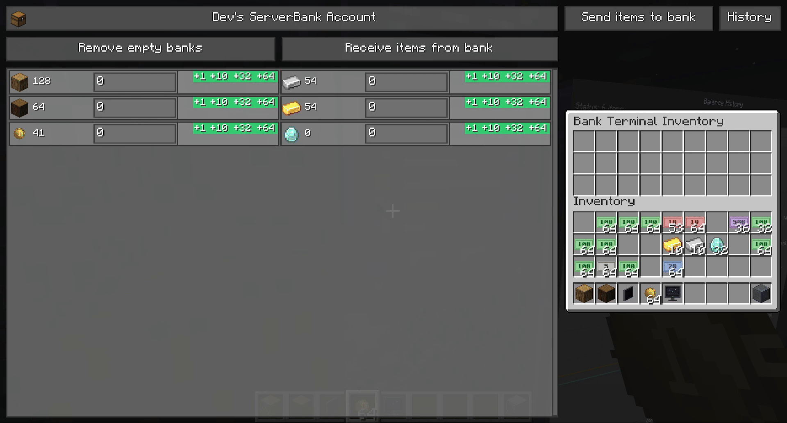
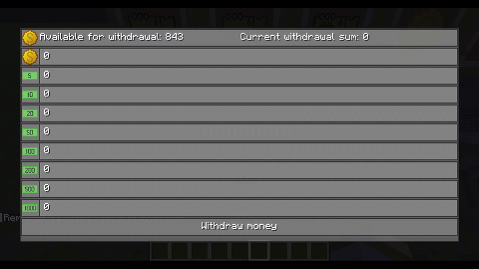
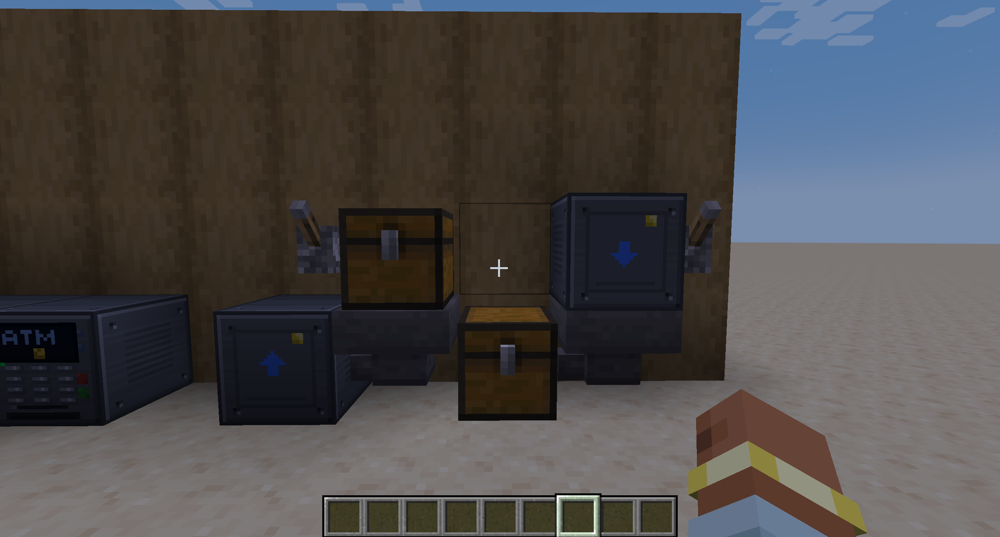
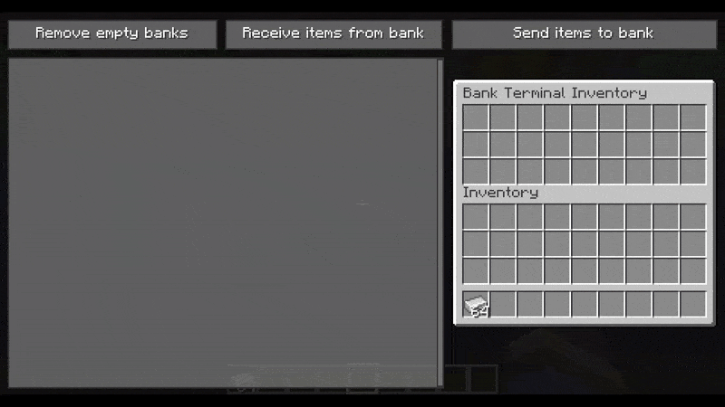
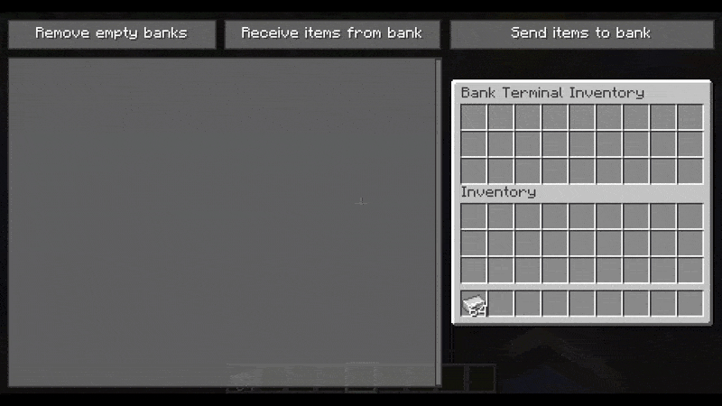
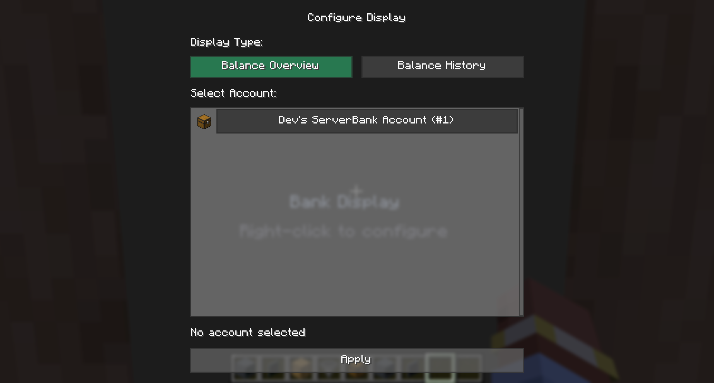
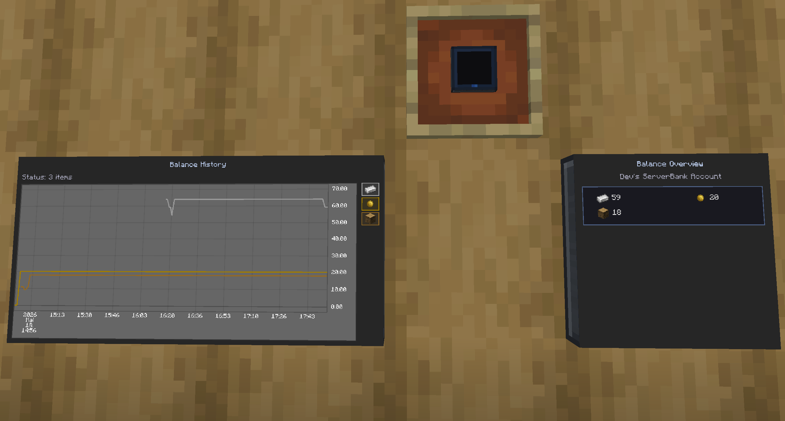
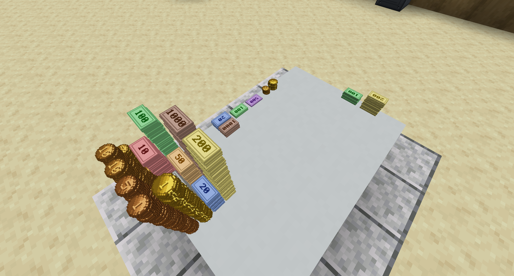

# Block Usage

## Bank Terminal Block

     

The Bank Terminal Block is used to deposit/withdraw items to/from the bank account.

> [!NOTE]  
> The block contains an inventory which is unique for every player. 
> Like an ender chest, but when the block gets destroyed, 
> items not stored in the bank account will be dropped.

---
## ATM Block

     

The ATM Block lets you withdraw money as specific bank notes.

---
## Automation Blocks

     

### Bank Upload Block

     

To use the Bank Upload Block, it has to be connected to your bank account.
Open the block and press on the **Connect to Bank** button.

- **Drop items if not bankable:**
   This setting specifies if the block drops items that can not be stored in the bank or not.

Once the block is connected to your bank account, items can be placed in it.
To send the items to the bank account, the block must be powered by a redstone signal.

### Bank Download Block

     

To use the Bank Download Block, it has to be connected to your bank account.
Open the block and press on the **Connect to Bank** button.

- **Balance:** Shows the current balance in the connected bank account.

- **Amount:** Define how many items the block should try to hold in its inventory.
   If items get removed from the inventory, the block tries to download new items until the specified amount is reached.

- **Condition:** Set a condition for when items should be downloaded from the bank:
   - **No condition** — Keep the target amount in the inventory at all times.
   - **More than** — Only download items if the bank balance exceeds the specified value.
   - **Less than** — Only download items if the bank balance is below the specified value.

Press the **Save** button to apply the changes.
Once the block is configured, a redstone signal triggers the block to work.

---
## Bank Display

     

The Bank Display block shows live bank account data on its screen. Right-click the block to open the configuration screen.

1. Select a **Display Type** — Balance Overview or Balance History.
2. Select the **bank account** to display.
3. Press **Apply** to save the configuration.

     

| Display Mode | Description |
|--------------|-------------|
| **Balance Overview** | A compact grid showing the current balances of the highest-value items in the account. Displays item icons with their amounts. Updates every second. |
| **Balance History** | A line chart tracking balance changes over time for all items in the account. Each item is color-coded with a legend on the right. Updates every 60 seconds. |

---
## Money Stockpile

     

Money items can be placed in the world as decorative blocks. Each denomination has its own block model — coins stack as piles and bills stand upright. The blocks can also be used for physical storage of money outside the banking system.
