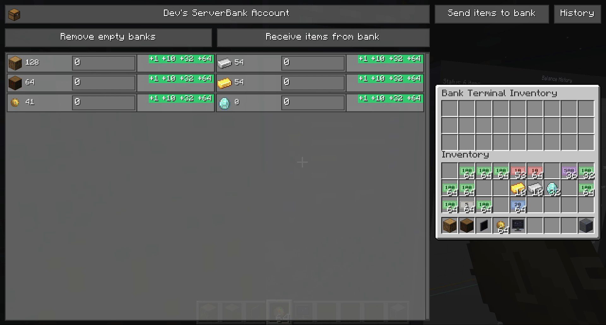
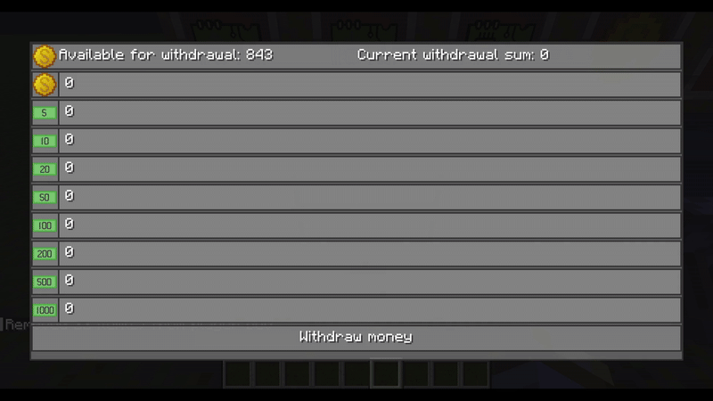
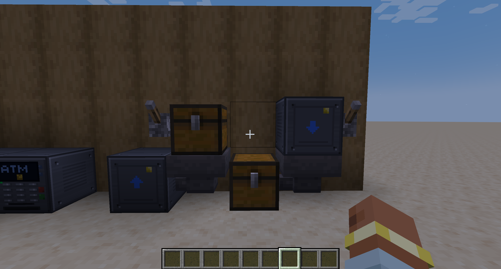
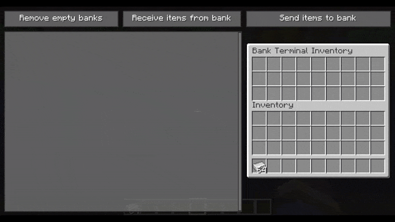
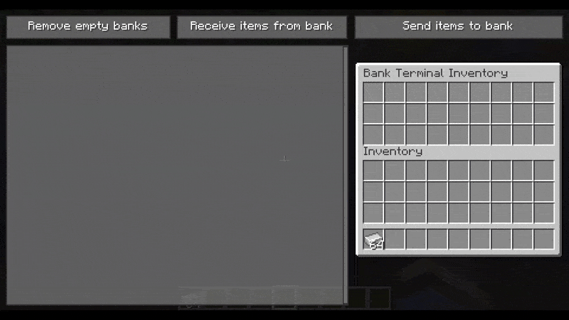
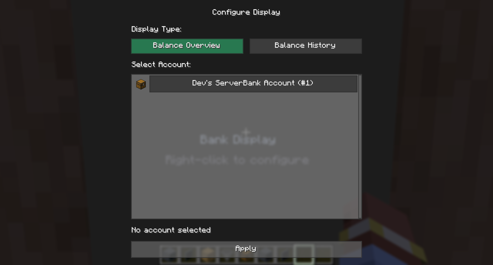
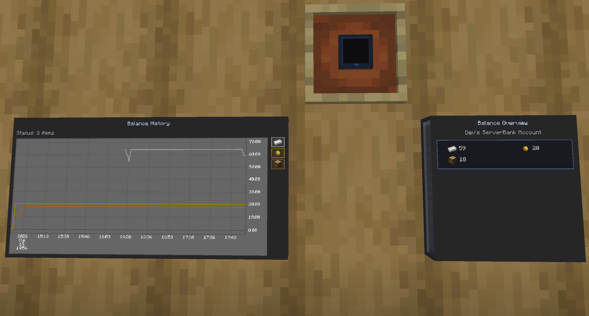
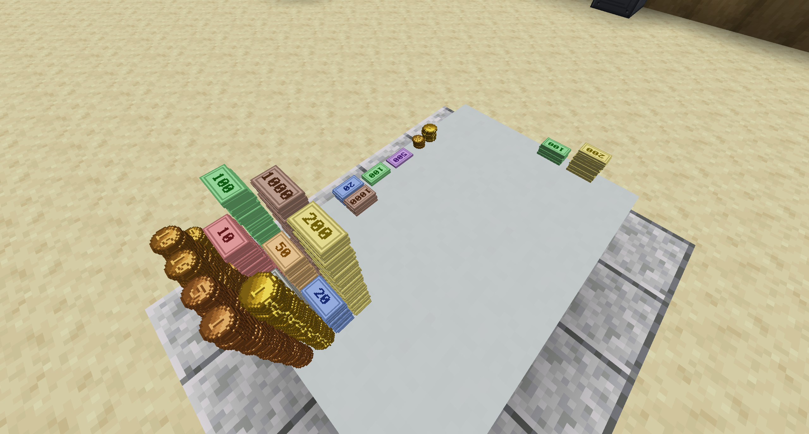

# Block Usage

## Bank Terminal Block

     

The Bank Terminal Block is used to deposit/withdraw items to/from the bank account.
Use the **Filter** box above the bank item list to quickly find an item by name.

> [!NOTE]  
> The block contains an inventory which is unique for every player. 
> Like an ender chest, but when the block gets destroyed, 
> items not stored in the bank account will be dropped.

### Crafting in the Bank Terminal

The Bank Terminal screen includes a 3×3 crafting grid with a result slot, located above the container inventory.
All standard crafting recipes work in it — vanilla, datapack, and modded shaped or shapeless recipes.

With both checkboxes turned off, the grid behaves exactly like a vanilla crafting table:
pick up the result with the cursor, or shift-click the result slot to craft a whole batch (up to one full output stack per click).

Two checkboxes connect the crafting grid to your bank account:

- **Use Bank Items** — Missing ingredients in the grid are supplied from the selected bank account automatically.
  Place at least one physical item in the grid to start the recipe; faded "ghost" icons then preview which items the bank will provide.
  Money items are never used as crafting ingredients.
  This option requires **withdraw** permission on the account — the checkbox is disabled without it.

- **Auto-deposit output** — Crafted items are deposited directly into the bank account instead of going to your inventory or cursor.
  This option requires **deposit** permission on the account.
  If a crafted item cannot be stored in the bank, it is moved to your inventory instead and a message explains why.

Both checkbox states are remembered per player on that terminal, so your setup is restored the next time you open it.

> [!NOTE]  
> Items left in the crafting grid are returned to your inventory when you close the screen —
> they are never deposited into the bank automatically.

Crafting with bank items also works on multi-server setups (player on one server, bank account on the master server), just like all other bank operations.

### JEI Integration

If [JEI](https://www.curseforge.com/minecraft/mc-mods/jei) is installed:

- The **+** button in the JEI recipe view fills the crafting grid with the ingredients from your inventory.
- Clicking an item in the bank list looks up its recipes and applies the best one your bank account can actually satisfy.
- The JEI item panel sits beside the Bank Terminal screen without overlapping it.

### Balance History Chart

The **History** button in the top-right of the Bank Terminal opens a line chart of the selected account's balances over time — one colour-coded series per item.

- **Timescale buttons** (`1h`, `6h`, `1d`, `7d`, `30d`, `all`) in the top-left reframe the chart in one click. The view always spans the window you picked, even when the account is younger than that.
- **Pan and zoom** with drag and mouse wheel. On a finite timescale, older history is streamed in the background before you reach the edge of the loaded data, and zooming out stops at the selected window — pick a bigger timescale to see further back.
- A **search box** filters the series by item name or tag, and per-item checkboxes turn individual series on and off. Both are remembered between sessions.

How often the underlying snapshots are taken, and how long they are kept, is controlled by the `BALANCE_SNAPSHOT_*` and `BALANCE_HISTORY_RETENTION_SWEEP_MINUTES` settings — see [Configuration](Configuration.md#utilities-section).

---
## ATM Block

     

The ATM Block has two tabs; the account selector between them applies to both.

### Withdraw tab

Withdraw money from the selected bank account as specific bank notes. Pick a count per denomination with the `+N` / `-N` buttons or by typing into the field. Denominations you cannot afford are greyed out with an **Insufficient balance** tooltip, and typed amounts are clamped to what the account covers.

### Convert tab

Exchange notes for a different mix of the same value, without touching a bank account:

1. **Deposit money from inventory** sweeps every coin and note you carry into a temporary cache.
2. Pick any combination of denominations up to the cached total and withdraw it.
3. If something is left over, either **Deposit remainder to bank** (into the selected account, as a normal deposit) or **Drop remainder** to get it at your feet as the fewest possible notes.

> [!NOTE]
> Closing the screen or disconnecting with a non-zero cache drops the remainder at the ATM as a minimum-item split — nothing is lost.

---
## Automation Blocks

     

### Bank Upload Block

     

To use the Bank Upload Block, it has to be connected to your bank account.
Open the block and press on the **Connect to Bank** button.

- **Drop items if not bankable:**
   This setting specifies if the block drops items that can not be stored in the bank or not.

Once the block is connected to your bank account, items can be placed in it.
To send the items to the bank account, the block must be powered by a redstone signal.

### Bank Download Block

     

To use the Bank Download Block, it has to be connected to your bank account.
Open the block and press on the **Connect to Bank** button.

- **Balance:** Shows the current balance in the connected bank account.

- **Amount:** Define how many items the block should try to hold in its inventory.
   If items get removed from the inventory, the block tries to download new items until the specified amount is reached.

- **Condition:** Set a condition for when items should be downloaded from the bank:
   - **No condition** — Keep the target amount in the inventory at all times.
   - **More than** — Only download items if the bank balance exceeds the specified value.
   - **Less than** — Only download items if the bank balance is below the specified value.

Press the **Save** button to apply the changes.
Once the block is configured, a redstone signal triggers the block to work.

---
## Bank Display

     

The Bank Display block shows live bank account data on its screen. Right-click the block to open the configuration screen.

1. Select a **Display Type** — Balance Overview or Balance History.
2. Select the **bank account** to display.
3. Press **Apply** to save the configuration.

     

| Display Mode | Description |
|--------------|-------------|
| **Balance Overview** | A compact grid showing the current balances of the highest-value items in the account. Displays item icons with their amounts. Updates every second. |
| **Balance History** | A line chart tracking balance changes over time for all items in the account. Each item is color-coded with a legend on the right. Updates every 60 seconds. |

> [!TIP]
> Place displays next to each other to build a larger screen: a freshly placed display adopts the configuration of an already configured neighbour, so the whole multi-block shows one continuous image.

---
## Share Stamper

The **Share Stamper** mints a company's physical shares from Blank Shares, and turns them back in Redeem mode. Because it only makes sense together with a company, it is documented in the [Companies guide](Companies.md#issuing-physical-shares).

---
## Money Stockpile

     

Money items can be placed in the world as decorative blocks. Each denomination has its own block model — coins stack as piles and bills stand upright. The blocks can also be used for physical storage of money outside the banking system.
